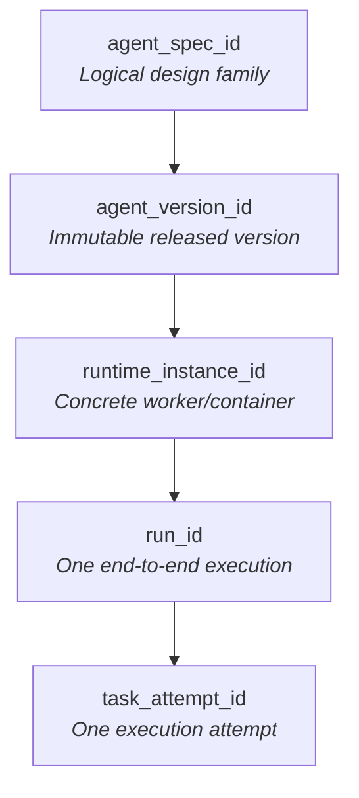
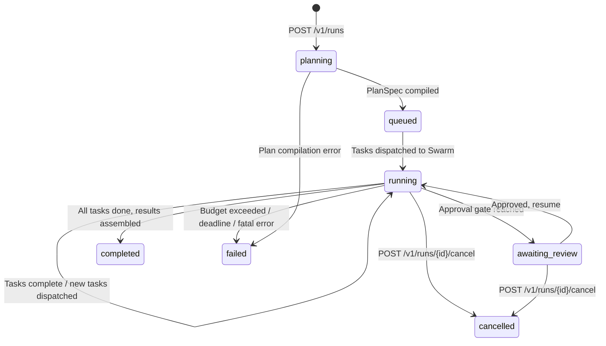
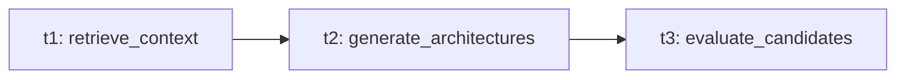
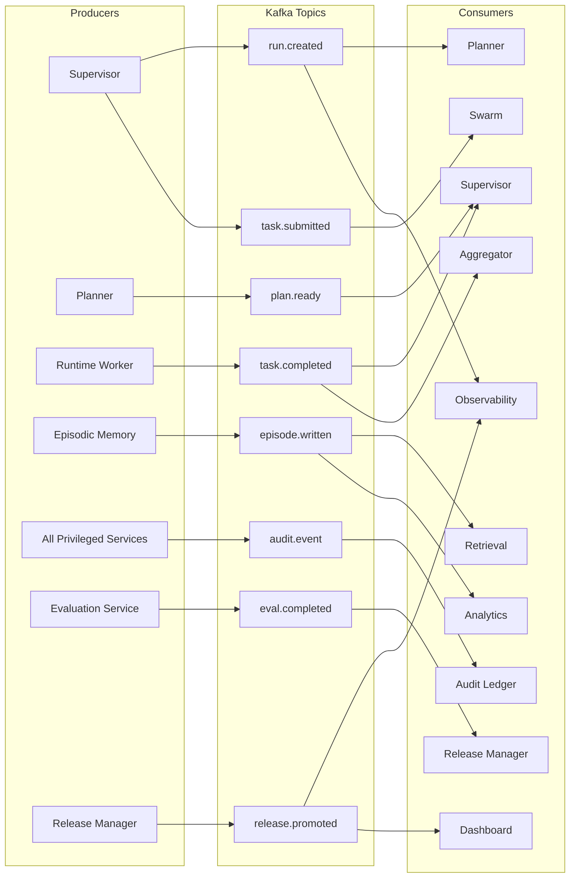
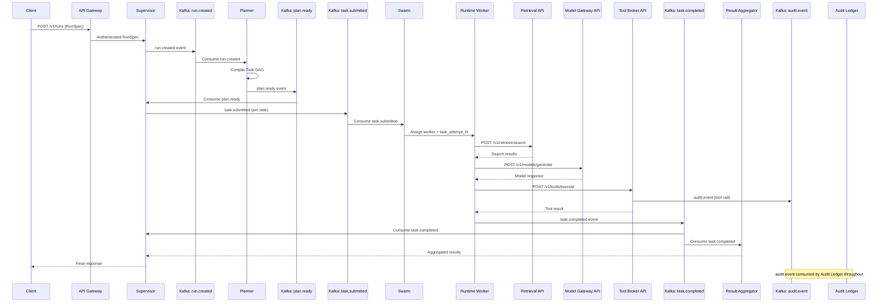
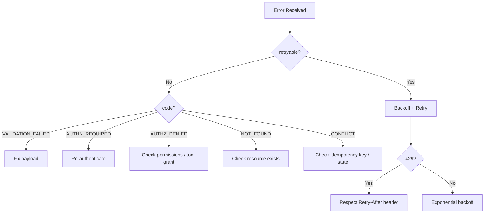

# Agent Architect Pro — API Contracts Deep Dive

> Complete specification of all synchronous APIs, async event contracts, identity model, standard envelopes, security rules, error handling, and compatibility policies.

---

## Foundation: 6 Canonical Design Rules

Every API and event in the platform follows these non-negotiable rules:

| Rule | Decision |
|------|----------|
| **API Style** | JSON over HTTPS for public/service APIs. Internal high-throughput calls may use gRPC behind the same logical contract |
| **Versioning** | URI major versioning: `/v1/…`. Additive changes OK within v1. Breaking changes → `/v2` |
| **Authentication** | All privileged calls require a bearer token. Workers use short-lived workload tokens from Token Service |
| **Idempotency** | POST operations that create/trigger state transitions must accept `Idempotency-Key` or `client_request_id` |
| **Tracing** | Every request/event must carry `trace_id`, `run_id` (when available), `task_attempt_id` (when execution-related) |
| **Error Model** | Standard error envelope with code, message, retryability, correlation_id, and optional field violations |

---

## Standard Envelopes

Every API call in the platform wraps its data in standardized envelopes for consistency across all 32 services.

### Request Metadata (included in ALL requests)

```json
{
  "request_meta": {
    "tenant_id": "tenant-acme",
    "trace_id": "trc_01H...",
    "client_request_id": "req_123",
    "actor_id": "usr_456",
    "policy_profile": "enterprise-strict",
    "requested_by_role": "builder"
  }
}
```

| Field | Type | Required | Purpose |
|-------|------|----------|---------|
| `tenant_id` | string | ✅ | Tenant isolation boundary |
| `trace_id` | string | ✅ | Distributed tracing correlation |
| `client_request_id` | string | ✅ | Idempotency key (24h window) |
| `actor_id` | string | ✅ | Human or machine identity |
| `policy_profile` | string | ⚪ | Named policy set to apply |
| `requested_by_role` | string | ⚪ | Caller's product role for UI/audit |

### Success Envelope

```json
{
  "status": "ok",
  "data": { /* service-specific payload */ },
  "meta": {
    "trace_id": "trc_01H...",
    "version": "v1",
    "generated_at": "2026-03-22T10:15:00Z"
  }
}
```

### Error Envelope

```json
{
  "status": "error",
  "error": {
    "code": "POLICY_VIOLATION",
    "message": "Tool call blocked by policy.",
    "retryable": false,
    "correlation_id": "corr_789",
    "details": {
      "policy_rule": "TOOL.RESTRICTED.NETWORK",
      "violations": [
        {"field": "tool_name", "reason": "blocked"}
      ]
    }
  }
}
```

| Field | Type | Purpose |
|-------|------|---------|
| `code` | string | Machine-readable error code (see error table) |
| `message` | string | Human-readable explanation |
| `retryable` | boolean | Whether the client should retry |
| `correlation_id` | string | Links to trace/audit for debugging |
| `details.violations` | array | Per-field validation errors |

---

## Identity Model

The platform uses **5 canonical identifiers** — never a single overloaded "agent ID":



| Identifier | Purpose | Issuer | Lifetime |
|-----------|---------|--------|----------|
| `agent_spec_id` | Logical design definition for an agent family | Design/build pipeline | Long-lived until superseded |
| `agent_version_id` | Immutable released implementation | Release Manager | **Never mutated** |
| `runtime_instance_id` | Concrete worker/container executing tasks | Runtime Manager | Short-lived, rotating |
| `run_id` | One end-to-end user/API request execution | Supervisor | Per request |
| `task_attempt_id` | One scheduled execution attempt for a task | Swarm Orchestrator | Per retry/placement |

---

## Complete Endpoint Registry

| # | Service | Method | Endpoint | Purpose |
|---|---------|--------|----------|---------|
| 1 | **Supervisor** | `POST` | `/v1/runs` | Start a governed run |
| 2 | **Supervisor** | `GET` | `/v1/runs/{run_id}` | Inspect run state and milestones |
| 3 | **Supervisor** | `POST` | `/v1/runs/{run_id}/cancel` | Cancel an in-flight run |
| 4 | **Planner** | `POST` | `/v1/plans` | Compile goal into budgeted Task DAG |
| 5 | **Retrieval** | `POST` | `/v1/retrieve/search` | Search knowledge, episodes, artifacts |
| 6 | **Identity** | `POST` | `/v1/identity/tokens/issue` | Issue short-lived workload token |
| 7 | **Tool Broker** | `POST` | `/v1/tools/execute` | Execute an allowed tool with audit |
| 8 | **Model Gateway** | `POST` | `/v1/models/generate` | Text generation for reasoning/drafting |
| 9 | **Evaluation** | `POST` | `/v1/evaluations/candidates` | Evaluate candidate against benchmarks |
| 10 | **Release** | `POST` | `/v1/releases/promote` | Promote signed candidate to environment |
| 11 | **Audit** | `GET` | `/v1/audit/runs/{run_id}` | Query immutable evidence for a run |

---

## Synchronous API #1: Supervisor

### `POST /v1/runs` — Start a Governed Run

**Request:**
```json
{
  "request_meta": {
    "tenant_id": "tenant-acme",
    "client_request_id": "req_123"
  },
  "objective": "Design a medical research analyst agent",
  "constraints": {
    "deadline_ms": 180000,
    "max_cost_usd": 40,
    "risk_profile": "high-regulated"
  },
  "inputs": {
    "domain": "healthcare",
    "required_outputs": ["brief", "architecture", "evaluation_plan"]
  }
}
```

**Response (201 Created):**
```json
{
  "status": "ok",
  "data": {
    "run_id": "run_01J...",
    "state": "planning",
    "next_action": "plan_requested"
  },
  "meta": {"trace_id": "trc_01H..."}
}
```

**Request Schema:**

| Field | Type | Required | Validation |
|-------|------|----------|------------|
| `request_meta.tenant_id` | string | ✅ | Must exist in identity registry |
| `request_meta.client_request_id` | string | ✅ | Idempotency key (24h dedup window) |
| `objective` | string | ✅ | Non-empty goal description |
| `constraints.deadline_ms` | integer | ⚪ | Must be within tenant policy limits |
| `constraints.max_cost_usd` | number | ⚪ | Must be within tenant policy limits |
| `constraints.risk_profile` | string | ⚪ | Enum: `low`, `standard`, `high-regulated` |
| `inputs.domain` | string | ⚪ | Domain context for retrieval/planning |
| `inputs.required_outputs` | string[] | ⚪ | Expected deliverables |

**Validation Rules:**
- `objective` must be present and non-empty
- `tenant_id` must be present
- `cost` and `deadline` must be inside tenant policy limits
- Repeated calls with same `client_request_id` within 24h return the same `run_id` (unless payload differs)

### Run State Machine



| State | Description | Transitions To |
|-------|-------------|---------------|
| `planning` | Planner is compiling TaskDAG | `queued`, `failed` |
| `queued` | Tasks ready, awaiting Swarm scheduling | `running` |
| `running` | Tasks actively executing in workers | `awaiting_review`, `completed`, `failed`, `cancelled` |
| `awaiting_review` | Approval gate — blocked on human/policy decision | `running`, `cancelled` |
| `completed` | All tasks done, results assembled | Terminal |
| `failed` | Budget/deadline exceeded or fatal error | Terminal |
| `cancelled` | Explicitly cancelled by user/system | Terminal |

### `GET /v1/runs/{run_id}` — Inspect Run State

Returns current state, milestones, task progress, and summary. Consumers should use this for polling the run status.

### `POST /v1/runs/{run_id}/cancel` — Cancel Run

Triggers graceful shutdown of in-flight tasks. Workers receive cancellation signals; partial results are preserved for audit.

---

## Synchronous API #2: Planner

### `POST /v1/plans` — Compile Goal into Task DAG

**Request:**
```json
{
  "request_meta": {
    "tenant_id": "tenant-acme",
    "trace_id": "trc_01H..."
  },
  "goal": "Design a financial risk analyst agent",
  "budget": {
    "max_tokens": 200000,
    "max_cost_usd": 25
  },
  "policy_profile": "enterprise-strict"
}
```

**Response (200 OK):**
```json
{
  "status": "ok",
  "data": {
    "plan_id": "plan_01J...",
    "tasks": [
      {"task_id": "t1", "type": "retrieve_context", "deps": []},
      {"task_id": "t2", "type": "generate_architectures", "deps": ["t1"]},
      {"task_id": "t3", "type": "evaluate_candidates", "deps": ["t2"]}
    ]
  }
}
```

**Response Schema:**

| Field | Type | Description |
|-------|------|-------------|
| `plan_id` | string | Unique identifier for this plan |
| `tasks` | TaskSpec[] | Array of executable tasks |
| `tasks[].task_id` | string | Identifier for this task |
| `tasks[].type` | string | Task type enum (e.g. `retrieve_context`, `generate_architectures`) |
| `tasks[].deps` | string[] | Task IDs that must complete before this task can start |

**Task DAG Visualization:**


> [!NOTE]
> The Planner is a **compiler, not a scheduler**. It returns the dependency graph but never places work on workers. The Supervisor submits runnable `TaskSpec` objects to the Swarm Orchestrator.

---

## Synchronous API #3: Retrieval Service

### `POST /v1/retrieve/search` — Search Knowledge Base

**Request:**
```json
{
  "request_meta": {
    "tenant_id": "tenant-acme",
    "trace_id": "trc_01H..."
  },
  "query": "medical evidence hierarchy",
  "scope": ["documents", "episodes", "artifacts"],
  "filters": {
    "tags": ["healthcare"],
    "freshness_days": 365
  },
  "top_k": 8
}
```

**Response (200 OK):**
```json
{
  "status": "ok",
  "data": {
    "results": [
      {
        "source_id": "doc_101",
        "title": "Clinical evidence standard",
        "score": 0.91
      },
      {
        "source_id": "ep_298",
        "title": "Prior regulated-agent episode",
        "score": 0.84
      }
    ]
  }
}
```

**Request Schema:**

| Field | Type | Required | Description |
|-------|------|----------|-------------|
| `query` | string | ✅ | Semantic search query |
| `scope` | string[] | ⚪ | Search domains: `documents`, `episodes`, `artifacts` |
| `filters.tags` | string[] | ⚪ | Filter by metadata tags |
| `filters.freshness_days` | integer | ⚪ | Only include sources updated within N days |
| `top_k` | integer | ⚪ | Number of results to return (default varies) |

**Response Schema:**

| Field | Type | Description |
|-------|------|-------------|
| `results` | SearchResult[] | Ranked results |
| `results[].source_id` | string | Unique source identifier |
| `results[].title` | string | Human-readable source title |
| `results[].score` | float | Relevance score (0.0–1.0) |

> [!NOTE]
> The Retrieval Service is **permission-aware** — results are filtered by tenant access policies. It uses pgvector for semantic similarity + optional reranker model for relevance refinement.

---

## Synchronous API #4: Tool Broker

### `POST /v1/tools/execute` — Execute Mediated Tool Call

**Request:**
```json
{
  "request_meta": {
    "tenant_id": "tenant-acme",
    "trace_id": "trc_01H..."
  },
  "runtime_instance_id": "rt_123",
  "run_id": "run_01J...",
  "task_attempt_id": "ta_456",
  "tool_name": "retrieval.search",
  "tool_grant_id": "grant_789",
  "payload": {
    "query": "evidence standard"
  }
}
```

**Request Schema:**

| Field | Type | Required | Description |
|-------|------|----------|-------------|
| `runtime_instance_id` | string | ✅ | Worker identity making the call |
| `run_id` | string | ✅ | Parent run for audit correlation |
| `task_attempt_id` | string | ✅ | Specific task attempt for tracing |
| `tool_name` | string | ✅ | Registered tool identifier |
| `tool_grant_id` | string | ✅ | Pre-approved grant from Policy Enforcer |
| `payload` | object | ✅ | Tool-specific input payload |

**Behavioral Rules:**

| Rule | Detail |
|------|--------|
| **Policy check first** | Policy Enforcer validates the grant before any execution. Missing/expired grant → `AUTHZ_DENIED` |
| **Always audited** | Both successful AND blocked calls generate `AuditEvent` records |
| **Long-running tools** | Return an `operation_id` and support callback or polling semantics |
| **Credential brokering** | Tool Broker injects credentials from Vault — workers never see raw secrets |

> [!CAUTION]
> This is the **choke point** for ALL external actions. Every tool call, API call, and external interaction passes through the Tool Broker. Bypassing it breaks policy enforcement, auditability, and credential security.

---

## Synchronous API #5: Model Gateway

### `POST /v1/models/generate` — Text Generation

**Request:**
```json
{
  "request_meta": {
    "tenant_id": "tenant-acme",
    "trace_id": "trc_01H..."
  },
  "task_type": "reasoning",
  "model_policy": {
    "latency_tier": "standard",
    "max_cost_usd": 0.50
  },
  "context_refs": ["doc_101", "ep_298"],
  "messages": [
    {"role": "system", "content": "You are a senior AI architect."},
    {"role": "user", "content": "Generate 3 architectures."}
  ]
}
```

**Request Schema:**

| Field | Type | Required | Description |
|-------|------|----------|-------------|
| `task_type` | string | ✅ | Task intent: `reasoning`, `code_generation`, `embedding`, `reranking` |
| `model_policy.latency_tier` | string | ⚪ | `fast`, `standard`, `quality` — gateway picks the model |
| `model_policy.max_cost_usd` | number | ⚪ | Per-call cost ceiling |
| `context_refs` | string[] | ⚪ | References to retrieved context for grounding |
| `messages` | Message[] | ✅ | Chat-format messages |

**Key Behaviors:**

| Behavior | Detail |
|----------|--------|
| **Provider abstraction** | Gateway **hides** provider/model selection. Clients specify `task_type` + `model_policy`, not vendor-specific parameters |
| **Response metadata** | Responses include `token_counts`, `latency_ms`, `model_route`, `cache_hit` |
| **Streaming** | Optional — same contract supports sync and chunked delivery |
| **Routing** | Gateway routes to the optimal provider based on policy, cost, latency, and availability |
| **Quota enforcement** | Per-tenant and per-run cost tracking; separate quota pool for improvement plane |

> [!IMPORTANT]
> The Model Gateway is the second **choke point**. All model inference — regardless of provider, model type, or task — routes through this single abstraction layer.

---

## Additional Synchronous APIs

### Identity: `POST /v1/identity/tokens/issue`
Issues a short-lived workload token for a runtime worker. Tokens are audience-bound, least-privilege, and expire quickly.

### Evaluation: `POST /v1/evaluations/candidates`
Triggers a benchmark/safety/regression evaluation against a candidate package. Returns an `EvaluationReport` with pass/fail recommendation.

### Release: `POST /v1/releases/promote`
Promotes a signed candidate artifact to a target environment (staging → canary → production). Requires evaluation evidence and approval.

### Audit: `GET /v1/audit/runs/{run_id}`
Queries the immutable audit evidence associated with a run — all actions, tool calls, model requests, approvals, and policy decisions.

---

## Asynchronous Event System (Kafka)

### Event Envelope Standard

Every async event follows this envelope:

```json
{
  "topic": "task.completed",
  "event_version": "1.0",
  "event_id": "evt_01J...",
  "trace_id": "trc_01H...",
  "run_id": "run_01J...",
  "task_attempt_id": "ta_456",
  "producer": "runtime-worker",
  "occurred_at": "2026-03-22T10:33:00Z",
  "payload": { /* topic-specific data */ }
}
```

| Field | Type | Required | Description |
|-------|------|----------|-------------|
| `topic` | string | ✅ | Event topic name |
| `event_version` | string | ✅ | Schema version for forward compatibility |
| `event_id` | string | ✅ | Globally unique event identifier |
| `trace_id` | string | ✅ | Distributed tracing correlation |
| `run_id` | string | ⚪ | Business correlation (when available) |
| `task_attempt_id` | string | ⚪ | Execution correlation (when applicable) |
| `producer` | string | ✅ | Publishing service name |
| `occurred_at` | ISO8601 | ✅ | Event timestamp |
| `payload` | object | ✅ | Topic-specific data |

### 8 Core Event Topics



### Topic Details

#### 1. `run.created`
| Attribute | Value |
|-----------|-------|
| **Producer** | Supervisor |
| **Consumers** | Planner, Observability |
| **Purpose** | Lifecycle start signal — triggers plan compilation |
| **Payload** | `run_id`, `tenant_id`, `objective`, `constraints`, `policy_profile` |

#### 2. `plan.ready`
| Attribute | Value |
|-----------|-------|
| **Producer** | Planner |
| **Consumer** | Supervisor |
| **Purpose** | Task DAG compiled and ready for dispatch |
| **Payload** | `plan_id`, `run_id`, `tasks[]`, `budget` |

#### 3. `task.submitted`
| Attribute | Value |
|-----------|-------|
| **Producer** | Supervisor |
| **Consumer** | Swarm Orchestrator |
| **Purpose** | Runnable task issued for scheduling |
| **Payload** | `task_id`, `run_id`, `task_type`, `deps`, `tool_policy`, `context_refs` |

#### 4. `task.completed`
| Attribute | Value |
|-----------|-------|
| **Producer** | Runtime Worker |
| **Consumers** | Supervisor, Result Aggregator |
| **Purpose** | Task execution result available |
| **Payload** | `task_id`, `status`, `outputs`, `artifact_refs`, `cost_usd`, `latency_ms` |

**Sample payload:**
```json
{
  "task_id": "t3",
  "status": "succeeded",
  "outputs": {"artifact_refs": ["cand_001"]},
  "cost_usd": 1.42,
  "latency_ms": 4820
}
```

#### 5. `episode.written`
| Attribute | Value |
|-----------|-------|
| **Producer** | Episodic Memory Service |
| **Consumers** | Retrieval Service, Analytics |
| **Purpose** | Reusable learning artifact has been stored |
| **Payload** | `episode_id`, `run_id`, `summary`, `tags`, `quality_score` |

#### 6. `audit.event`
| Attribute | Value |
|-----------|-------|
| **Producer** | All privileged services |
| **Consumer** | Audit Ledger |
| **Purpose** | Append-only evidence stream |
| **Payload** | `event_id`, `actor`, `action`, `target`, `prev_hash`, `hash`, `timestamp` |

> [!IMPORTANT]
> This is the most critical event topic. Every tool call, model request, approval decision, policy change, and deployment action emits to this topic.

#### 7. `eval.completed`
| Attribute | Value |
|-----------|-------|
| **Producer** | Evaluation Service |
| **Consumer** | Release Manager |
| **Purpose** | Candidate evaluation evidence ready for promotion decision |
| **Payload** | `candidate_id`, `baseline_version`, `quality`, `cost`, `latency`, `safety`, `recommendation` |

#### 8. `release.promoted`
| Attribute | Value |
|-----------|-------|
| **Producer** | Release Manager |
| **Consumers** | Observability, Executive Dashboard |
| **Purpose** | Deployment state transition event |
| **Payload** | `agent_version_id`, `target_env`, `promotion_type`, `approver_id`, `evidence_refs` |

---

## End-to-End Request Flow with Contracts



---

## Error Handling

### Standard Error Codes

| Code | HTTP Status | Meaning | Retryable? |
|------|-------------|---------|------------|
| `VALIDATION_FAILED` | 400 | Input payload or field rules failed | ❌ No |
| `AUTHN_REQUIRED` | 401 | Missing or invalid credentials | ❌ No |
| `AUTHZ_DENIED` | 403 | Caller lacks rights or tool grant | ❌ No |
| `NOT_FOUND` | 404 | Run/plan/token/artifact not found | ❌ No |
| `CONFLICT` | 409 | State transition or idempotency mismatch | ⚠️ Maybe |
| `RATE_LIMITED` | 429 | Per-tenant or per-service quota exceeded | ✅ Yes |
| `UPSTREAM_TIMEOUT` | 504 | Model route or dependent service timed out | ✅ Yes |

### Error Flow Decision Tree


---

## Security & Compatibility Rules

| Area | Rule |
|------|------|
| **Transport** | TLS everywhere. Internal service mesh **mTLS** recommended |
| **Tokens** | Workload tokens are short-lived, audience-bound, least-privilege |
| **PII** | Sensitive fields tagged and excluded from broad observability payloads |
| **Schema Evolution** | Additive fields only within v1. Consumers **must ignore** unknown fields |
| **Deprecation** | Deprecated fields require doc notice + **minimum two-release compatibility window** |
| **Rate Limits** | Per-tenant and per-service quotas with explicit 429 + `Retry-After` guidance |

---

## Acceptance Checklist

| # | Requirement |
|---|------------|
| 1 | Every service publishes an **OpenAPI spec** or protobuf equivalent derived from these contracts |
| 2 | Every privileged action produces a matching **AuditEvent** with `trace_id` and actor identity |
| 3 | Every client SDK exposes **idempotency**, correlation IDs, and standard error parsing |
| 4 | Contract tests validate both **happy-path and policy-failure** behavior for each endpoint |
| 5 | UI and workflow surfaces consume only **documented fields** and ignore additive unknowns |
