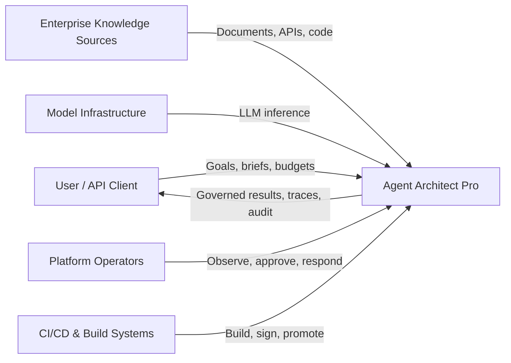
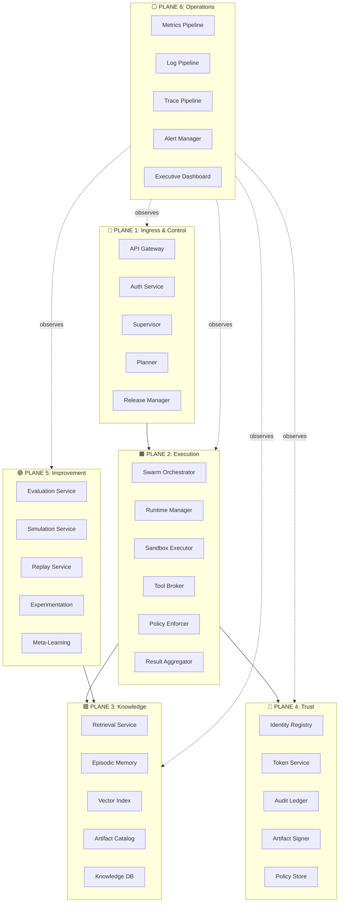
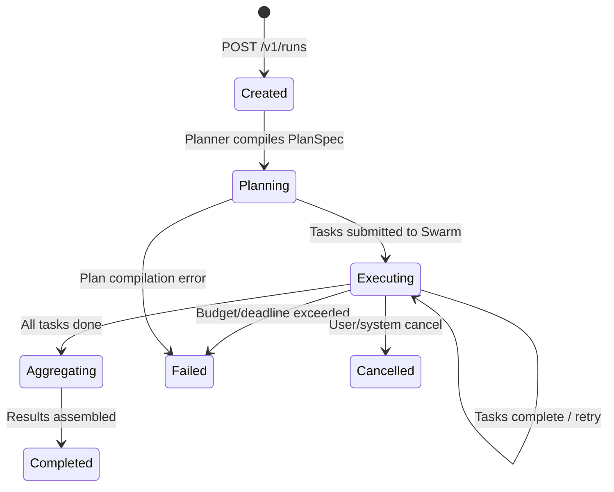
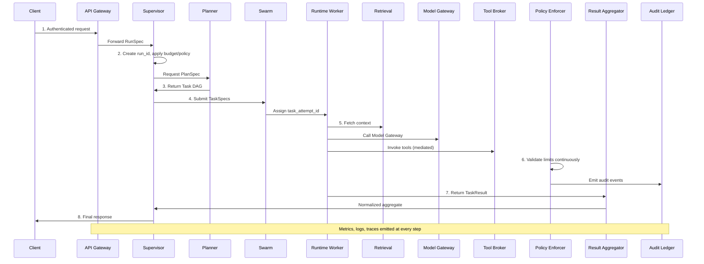
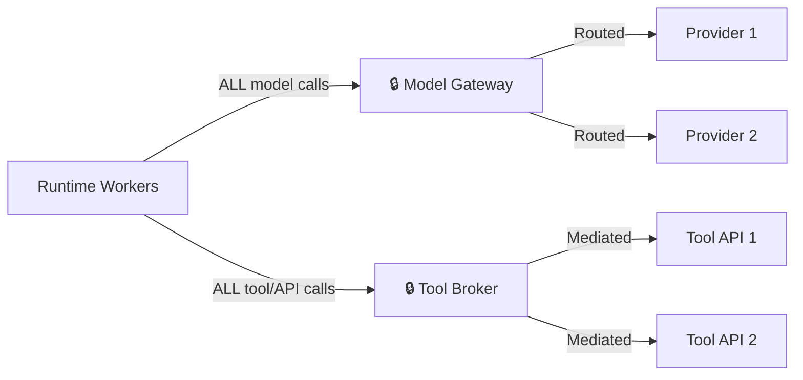

# Agent Architect Pro — Architecture Deep Dive

> Complete service-level decomposition of the six-plane architecture with every microservice, its contracts, boundaries, interactions, and implementation guidance.

---

## System Context (C4 Level 1)

The platform sits between **5 external actor types**:

| Actor | Interaction | Trust Boundary |
|-------|------------|----------------|
| **User / API Client** | Submits requests, receives results, monitors runs | Authentication, rate limiting, tenant isolation |
| **Enterprise Knowledge Sources** | Documents, APIs, tickets, code, historical runs indexed for retrieval | Authorization, freshness, data lineage, source trust |
| **Model Infrastructure** | Reasoning, code, embedding, reranking, evaluation inference | Quota isolation, latency, cost, model policy |
| **Platform Operators** | Observe health, approve promotions, respond to incidents, tune policy | Least privilege, auditability, rollback authority |
| **CI/CD & Build Systems** | Build, sign, evaluate, and promote agent artifacts and policy bundles | Artifact integrity, release gates, reproducibility |

---

## Container View (C4 Level 2) — The Six Planes

---

## PLANE 1: Ingress & Control (5 services)

**Mission**: Accept authenticated requests, manage run state, compile task DAGs, enforce budgets, approvals, and release rules.

> [!IMPORTANT]
> Goals and budgets enter here. **No worker scheduling logic lives in this plane.**

### 1.1 API Gateway

| Attribute | Detail |
|-----------|--------|
| **Responsibility** | Tenant-aware request intake, authentication, validation, rate limiting |
| **Inputs** | HTTP/gRPC requests from clients |
| **Outputs** | Authenticated `RunSpec` forwarded to Supervisor |
| **Stack** | Kong or NGINX Ingress + OAuth2/OIDC integration |
| **Hard Rule** | **Keep thin** — no business workflow logic whatsoever |

### 1.2 Auth Service

| Attribute | Detail |
|-----------|--------|
| **Responsibility** | OIDC/OAuth2 integration, role mapping, session management |
| **Interfaces** | JWT/OIDC validation, RBAC claims |
| **Stack** | Keycloak or Auth0 |
| **Works With** | Token Service (Trust plane) for workload tokens |

### 1.3 Supervisor Service

| Attribute | Detail |
|-----------|--------|
| **Responsibility** | Owns **run lifecycle state machine** — creation, retries, deadlines, budgets, approval gates, final assembly |
| **Inputs** | `RunSpec` from API Gateway |
| **Outputs** | `RunStatus` events, `TaskSpec` objects to Swarm |
| **Contracts** | `RunSpec`, `RunStatus`, `ExecutionBudget` |
| **Stack** | FastAPI + Temporal client + PostgreSQL |
| **Hard Rule** | **Must not dispatch workers directly** — delegates to Planner (for plans) and Swarm (for scheduling) |

### 1.4 Planner Service

| Attribute | Detail |
|-----------|--------|
| **Responsibility** | Compiles a goal into a **Task DAG** with dependencies, budgets, and quality gates |
| **Inputs** | Goal + constraints from Supervisor |
| **Outputs** | `PlanSpec` with task graph |
| **Stack** | FastAPI/Python + Pydantic contracts |
| **Hard Rule** | **Treat as compiler, not scheduler** — returns a plan but never places work |

### 1.5 Release Manager

| Attribute | Detail |
|-----------|--------|
| **Responsibility** | Evaluates evidence, manages promotion rules, canary approvals, rollback orchestration, signed release manifests |
| **Inputs** | `EvaluationReport` from Improvement plane |
| **Outputs** | Deployment actions (promote/rollback/hold) |
| **Stack** | FastAPI + Temporal + artifact registry integration |
| **Hard Rule** | **No direct mutation of running workers** |

---

## PLANE 2: Execution (6 services)

**Mission**: Place tasks, start workers, execute in sandboxed runtimes, mediate tool access, enforce policies, and merge outputs.

> [!IMPORTANT]
> **Every external action must be policy-checked and audited.** Runtime workers stay thin and stateless.

### 2.1 Swarm Orchestrator

| Attribute | Detail |
|-----------|--------|
| **Responsibility** | Queues runnable tasks, selects workers, controls concurrency and backpressure |
| **Key Data** | `TaskSpec`, `WorkerCapacity`, `QueueStatus` |
| **Stack** | Temporal activities + Kafka + Kubernetes worker queues |
| **Hard Rule** | **Owns placement only** — not business logic |
| **Creates** | `task_attempt_id` for each retry/placement attempt |

### 2.2 Runtime Manager

| Attribute | Detail |
|-----------|--------|
| **Responsibility** | Starts/stops workers, publishes capacity, assigns `runtime_instance_id`, tracks liveness |
| **Key Data** | `RuntimeInstance`, `Heartbeat`, `CapacityReport` |
| **Interfaces** | gRPC heartbeats, Kubernetes APIs |
| **Stack** | Python or Go control service + Kubernetes API |
| **Hard Rule** | **Keep workers replaceable** — no sticky state |

### 2.3 Sandbox Executor

| Attribute | Detail |
|-----------|--------|
| **Responsibility** | Provides **isolated compute** with egress/filesystem/resource controls |
| **Key Data** | `SandboxPolicy`, `ResourceQuota` |
| **Stack** | Kubernetes + container policies + network policies + seccomp |
| **Hard Rule** | **No unrestricted network or credentials** inside the sandbox |

### 2.4 Tool Broker ⚠️ CHOKE POINT

| Attribute | Detail |
|-----------|--------|
| **Responsibility** | **Mediates every external tool/API call** — credential brokering, audit logging, policy gating |
| **Key Data** | `ToolGrant`, `ToolCall`, `ToolResult` |
| **Interfaces** | REST/gRPC tool contracts |
| **Stack** | FastAPI or Go + Vault + audit hooks |
| **Hard Rule** | **Every single external action passes through here — no exceptions** |

> [!CAUTION]
> The Tool Broker is one of the two critical choke points. If bypassed, the platform loses policy enforcement, auditability, and credential security for all tool calls.

### 2.5 Policy Enforcer

| Attribute | Detail |
|-----------|--------|
| **Responsibility** | Checks step limits, tool limits, tenant policy, approval requirements **continuously during execution** |
| **Key Data** | `PolicyBundle`, `Decision`, `ViolationEvent` |
| **Hard Rule** | **Fail closed on missing policy** — if there's no rule, the action is denied |

### 2.6 Result Aggregator

| Attribute | Detail |
|-----------|--------|
| **Responsibility** | Combines task outputs, exposes normalized results back to the Supervisor |
| **Key Data** | `TaskResult`, `AggregatedResult` |
| **Hard Rule** | **Keep deterministic and schema-driven** — no creative merging |

---

## PLANE 3: Knowledge (5 services)

**Mission**: Serve semantic retrieval, reusable run summaries, indexed assets, and authoritative stored state.

> [!IMPORTANT]
> **Do not conflate prompt context with system-of-record state.** RAG owns semantic memory only.

### 3.1 Retrieval Service

| Attribute | Detail |
|-----------|--------|
| **Responsibility** | Semantic retrieval, ranking, reranking, grounding context selection |
| **Key Data** | `RetrievalRequest`, `SourceRecord`, vector hits |
| **Stack** | PostgreSQL + pgvector + object storage + reranker model |
| **Hard Rule** | **Owns semantic memory only** — not transactional state |

### 3.2 Episodic Memory Service

| Attribute | Detail |
|-----------|--------|
| **Responsibility** | Stores reusable run summaries and tool traces for future reference |
| **Key Data** | `EpisodeSummary`, `EpisodeQuery` |
| **Stack** | PostgreSQL + object storage + background summarization jobs |
| **Hard Rule** | **Useful for reuse** but is NOT the source-of-truth transactional state |

### 3.3 Vector Index

| Attribute | Detail |
|-----------|--------|
| **Responsibility** | Stores and queries embeddings for semantic search |
| **Storage** | PostgreSQL + pgvector (exact search initially, ANN indexes as corpus grows) |
| **Note** | Co-located with Retrieval Service in v1 |

### 3.4 Artifact Catalog

| Attribute | Detail |
|-----------|--------|
| **Responsibility** | Tracks built artifacts, bundles, prompt packages, manifests, and build records |
| **Key Data** | `ArtifactManifest`, `BuildRecord` |
| **Supports** | Search and lineage tracking |

### 3.5 Knowledge DB (PostgreSQL)

| Attribute | Detail |
|-----------|--------|
| **Responsibility** | Authoritative stored state for plans, runs, and outputs |
| **Stack** | PostgreSQL with strict migration discipline (Flyway/Alembic) |
| **Note** | System-of-record for operational data |

---

## PLANE 4: Trust (5–6 services)

**Mission**: Issue workload identity, authorize actions, maintain tamper-evident audit streams, sign artifacts, manage secrets, and store/enforce policy.

> [!IMPORTANT]
> Identity must be specific to **version, run, and runtime instance** — never use one overloaded "agent ID."

### 4.1 Identity Registry

| Attribute | Detail |
|-----------|--------|
| **Responsibility** | Maintains agent specs, agent versions, runtime instances, and release lineage |
| **Key Data** | `AgentSpec`, `AgentVersion`, `RuntimeInstance` |
| **Stack** | PostgreSQL with strict migration discipline |

#### Identity Model (5 canonical IDs)

| Identifier | Meaning | Created By | Lifetime |
|-----------|---------|-----------|----------|
| `agent_spec_id` | Logical design definition for an agent family | Build/design pipeline | Long-lived until superseded |
| `agent_version_id` | Immutable released implementation of that design | Release Manager | Long-lived; **never mutated** |
| `runtime_instance_id` | Concrete worker or container executing tasks | Runtime Manager | Short-lived or rotating |
| `run_id` | One end-to-end request execution | Supervisor | Per user/API request |
| `task_attempt_id` | One execution attempt for a task | Swarm Orchestrator | Per retry/placement attempt |

### 4.2 Token Service

| Attribute | Detail |
|-----------|--------|
| **Responsibility** | Issues **short-lived workload and tool-access tokens** |
| **Key Data** | `RuntimeToken`, `TokenClaims` |
| **Stack** | Keycloak or Auth0 + service mesh identity |
| **Hard Rule** | **Short-lived, least privilege** — no long-lived credentials in workers |

### 4.3 Audit Ledger

| Attribute | Detail |
|-----------|--------|
| **Responsibility** | **Append-only evidence stream** with hash chaining per event stream |
| **Key Data** | `AuditEvent` (run_id, task_attempt_id, actor, action, timestamp, prev_hash, hash) |
| **Stack** | PostgreSQL/ClickHouse + hash-chain jobs |
| **Hard Rule** | **Tamper-evident without blockchain dependency** — use append-only tables + hash chains in v1 |

### 4.4 Artifact Signer

| Attribute | Detail |
|-----------|--------|
| **Responsibility** | Signs deployable artifacts and policy bundles |
| **Key Data** | `SignedArtifact` |
| **Stack** | KMS/HSM-backed signing keys |
| **Hard Rule** | Reject unsigned artifacts in the release pipeline |

### 4.5 Policy Store

| Attribute | Detail |
|-----------|--------|
| **Responsibility** | Stores policy bundles, rules, and approval requirements consumed by the Policy Enforcer |
| **Key Data** | `PolicyBundle`, rules, tenant quotas |

### 4.6 Secrets / Vault

| Attribute | Detail |
|-----------|--------|
| **Responsibility** | Manages secrets outside application code and worker containers |
| **Stack** | HashiCorp Vault or cloud-native secret managers |
| **Hard Rule** | No raw credentials inside workers |

---

## PLANE 5: Improvement (5 services)

**Mission**: Test and compare candidates offline, generate evidence, and feed controlled optimization.

> [!CAUTION]
> **No experiment deploys directly to production.** Every candidate must earn a canary through evaluation. This plane uses a **separate quota pool** from production for model access.

### 5.1 Evaluation Service

| Attribute | Detail |
|-----------|--------|
| **Responsibility** | Runs benchmark suites, regressions, safety checks, and quality scoring |
| **Output** | `EvaluationReport` (candidate_id, baseline_version, quality, cost, latency, safety, recommendation) |
| **Hard Rule** | **Offline or pre-release only** — never on the live request path |
| **Stack** | Temporal + Kafka + object storage + analytics DB |

### 5.2 Simulation Service

| Attribute | Detail |
|-----------|--------|
| **Responsibility** | Creates synthetic scenarios, stress tests for tool failures, ambiguity, and scale |
| **Output** | `ScenarioPack`, `SimulationResult` |
| **Hard Rule** | **Uses a separate quota pool** from production model access |

### 5.3 Replay Service

| Attribute | Detail |
|-----------|--------|
| **Responsibility** | Replays historical traffic against candidate artifacts and compares with baseline |
| **Output** | `ReplayDiff` |
| **Hard Rule** | **Never on the critical path** of live requests |

### 5.4 Experimentation

| Attribute | Detail |
|-----------|--------|
| **Responsibility** | Manages A/B tests, feature flags, and controlled rollout experiments |
| **Phase** | Phase 4 (after core platform is stable) |

### 5.5 Meta-Learning

| Attribute | Detail |
|-----------|--------|
| **Responsibility** | Suggests candidate strategies or designs from historical evidence |
| **Output** | `CandidateArtifact`, `Recommendation` |
| **Hard Rule** | **No direct path to production** — outputs are suggestions only |
| **Phase** | Phase 4 (after core platform is stable) |

---

## PLANE 6: Operations (5 services)

**Mission**: Observe latency, failures, cost, model usage, tool reliability, policy violations, and release health across **all** planes.

> [!IMPORTANT]
> **Trace IDs must flow end-to-end.** No unaudited tool call or unsigned deployment. All planes share `run_id` and `task_attempt_id` as first-class correlation keys.

### 6.1 Metrics Pipeline

| Attribute | Detail |
|-----------|--------|
| **Stack** | Prometheus + OpenTelemetry |
| **Key Data** | `MetricsSeries` — API latency, task completion, model/tool usage, queue health, release status |

### 6.2 Log Pipeline

| Attribute | Detail |
|-----------|--------|
| **Stack** | Loki + OpenTelemetry |
| **Key Data** | `StructuredLogs` with `run_id` correlation |

### 6.3 Trace Pipeline

| Attribute | Detail |
|-----------|--------|
| **Stack** | Tempo + OpenTelemetry |
| **Key Data** | Distributed trace spans across all services |

### 6.4 Alert Manager

| Attribute | Detail |
|-----------|--------|
| **Responsibility** | SLO-based alerting for degraded health, queue growth, canary failure, missing telemetry |
| **Stack** | Prometheus Alertmanager / Grafana alerts |

### 6.5 Executive Dashboard

| Attribute | Detail |
|-----------|--------|
| **Responsibility** | Portfolio health views, SLO status, incident forensics, release health visibility |
| **Stack** | Grafana + custom Next.js dashboards |

---

## Canonical Request Flow (8 Steps)

The end-to-end path a request takes through all planes:

| Step | What Happens | Plane |
|------|-------------|-------|
| 1 | Gateway authenticates, validates, rate-limits, forwards `RunSpec` | Control |
| 2 | Supervisor creates `run_id`, records state, applies budget + policy | Control |
| 3 | Planner compiles Task DAG (`PlanSpec`) with budget and deadlines | Control |
| 4 | Supervisor submits `TaskSpec` objects to Swarm; Swarm assigns workers | Control → Execution |
| 5 | Worker fetches context from Retrieval, calls Model Gateway, invokes tools via Tool Broker | Execution + Knowledge |
| 6 | Policy Enforcer validates limits continuously; violations fail closed and are audited | Trust + Execution |
| 7 | Result Aggregator normalizes outputs, returns to Supervisor | Execution → Control |
| 8 | Metrics, logs, traces, and `AuditEvent`s emitted end-to-end | Operations + Trust |

---

## Data Architecture

| Data Domain | Primary Store | Why | Retention |
|-------------|--------------|-----|-----------|
| **Operational state** | PostgreSQL | Strong transactional guarantees for runs, versions, tasks, approvals | System of record; Alembic migrations |
| **Vectors & retrieval** | PostgreSQL + pgvector | Embeddings alongside metadata and relational joins | Exact search initially → ANN indexes at scale |
| **Artifacts & evidence** | S3-compatible object storage | Binary artifacts, evaluation bundles, documents, reports | Versioned, immutable release manifests |
| **Caching & coordination** | Redis | Hot metadata, rate-limit counters, ephemeral locks | No durable system-of-record data |
| **Analytics / audit search** | ClickHouse or PostgreSQL partitioning | Fast aggregation for high-volume audit/observability | Can defer to phase 2 |

---

## Cross-Cutting Architecture Rules

### Two Choke Points

### Non-Functional Requirements

| Domain | Required Policy |
|--------|----------------|
| **Availability** | Treat online path as a service platform: clear SLOs, graceful degradation, fast rollback |
| **Security** | No raw credentials inside workers. Short-lived tokens, mediated tools, auditable decisions |
| **Observability** | All planes emit structured logs and distributed traces using `run_id` + `task_attempt_id` |
| **Cost Control** | Enforce budgets at plan time AND runtime. Improvement plane uses isolated model quotas |
| **Release Management** | Signed artifact + EvaluationReport + canary are **mandatory** — no exceptions |

---

## Implementation Phasing

| Phase | Services to Build | Goal |
|-------|------------------|------|
| **Phase 1** (Core) | Gateway, Supervisor, Planner, Swarm, Runtime Manager, Sandbox, Tool Broker, Retrieval, Model Gateway, Identity Registry, Audit, baseline observability | **Production core** — end-to-end request flow |
| **Phase 2** (Governance) | Policy Enforcer hardening, signed workload tokens, artifact signing, tenant quotas, rollback automation, Release Manager | **Hardened governance** — trust and release controls |
| **Phase 3** (Quality) | Evaluation, Replay, Simulation, benchmark packs, safety regression suites | **Quality plane** — evidence-based releases |
| **Phase 4** (Improvement) | Episodic memory, experimentation, meta-learning, pattern mining | **Improvement plane** — learning from production |
| **Phase 5** (Advanced) | Debate, architecture search, selective evolutionary search | **Research features** — only after platform stability |

---

## Key Architecture Risks

| Risk | Impact | Mitigation |
|------|--------|------------|
| **Supervisor bottleneck** | Run latency degrades as orchestration logic grows | Keep it stateful but thin; push scheduling to Swarm, workflows to Temporal |
| **Too many online dependencies** | Operational fragility, poor MTTR | Keep online path minimal; move improvement workloads offline |
| **Tool misuse / secret leakage** | Security and compliance exposure | Centralize through Tool Broker + Vault-backed credentials |
| **Observability blind spots** | Hard to debug agent failures or cost spikes | OpenTelemetry from sprint one; shared correlation IDs |
| **Premature microservice sprawl** | Delivery slows before product value proven | Start with modular **monorepo**; split only where scaling/ownership requires |

---

## Complete Service Inventory (27 services across 6 planes)

| # | Service | Plane | Priority |
|---|---------|-------|----------|
| 1 | API Gateway | Control | Phase 1 |
| 2 | Auth Service | Control | Phase 1 |
| 3 | Supervisor | Control | Phase 1 |
| 4 | Planner | Control | Phase 1 |
| 5 | Release Manager | Control | Phase 2 |
| 6 | Swarm Orchestrator | Execution | Phase 1 |
| 7 | Runtime Manager | Execution | Phase 1 |
| 8 | Sandbox Executor | Execution | Phase 1 |
| 9 | Tool Broker | Execution | Phase 1 |
| 10 | Policy Enforcer | Execution | Phase 2 |
| 11 | Result Aggregator | Execution | Phase 1 |
| 12 | Retrieval Service | Knowledge | Phase 1 |
| 13 | Episodic Memory | Knowledge | Phase 4 |
| 14 | Vector Index | Knowledge | Phase 1 |
| 15 | Artifact Catalog | Knowledge | Phase 1 |
| 16 | Knowledge DB | Knowledge | Phase 1 |
| 17 | Identity Registry | Trust | Phase 1 |
| 18 | Token Service | Trust | Phase 1 |
| 19 | Audit Ledger | Trust | Phase 1 |
| 20 | Artifact Signer | Trust | Phase 2 |
| 21 | Policy Store | Trust | Phase 2 |
| 22 | Secrets / Vault | Trust | Phase 1 |
| 23 | Evaluation Service | Improvement | Phase 3 |
| 24 | Simulation Service | Improvement | Phase 3 |
| 25 | Replay Service | Improvement | Phase 3 |
| 26 | Experimentation | Improvement | Phase 4 |
| 27 | Meta-Learning | Improvement | Phase 4 |
| 28 | Metrics Pipeline | Operations | Phase 1 |
| 29 | Log Pipeline | Operations | Phase 1 |
| 30 | Trace Pipeline | Operations | Phase 1 |
| 31 | Alert Manager | Operations | Phase 2 |
| 32 | Executive Dashboard | Operations | Phase 3 |

> **Phase 1 = 18 services** (production core), **Phase 2 = 5 services** (governance), **Phase 3 = 4 services** (quality), **Phase 4 = 5 services** (improvement/advanced)
