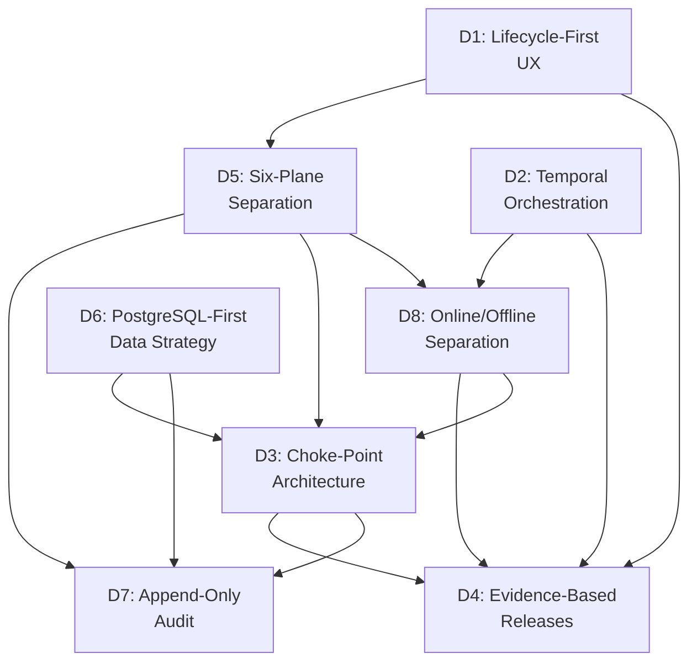
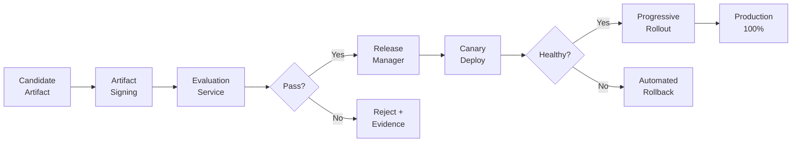

# Agent Architect Pro — 8 Critical Design Decisions Deep Dive

> The foundational choices that shape every service, API, screen, and sprint. Each decision is documented with rejected alternatives, rationale, enforcement rules, and cross-decision interactions.

---

## Decision Map



---

## D1 — Lifecycle-First UX (Not Dashboard, Not Chat)

### The Decision
Build the product as an **AI-native lifecycle studio** — Brief → Design → Compare → Evaluate → Approve → Deploy → Monitor → Improve — rather than a generic dashboard, chat-first copilot, or node-graph builder.

### Alternatives Rejected

| Alternative | Why Rejected |
|------------|-------------|
| **Dashboard-first control panel** | Over-centers operations; under-serves agent creation, architecture comparison, and trust-building for non-engineers |
| **Chat-first copilot workspace** | Weak for side-by-side comparison, governance, versioning, observability, and structured release review |
| **Node-graph builder as primary** | Too implementation-centric too early; poor starting point for new users and product sponsors |

### Rationale
- The product begins with a goal and ends with a deployed, governed agent — a lifecycle model mirrors the user's mental model directly
- The architecture is multi-plane and multi-role; role-aware modes let the same platform feel relevant to builders, operators, and executives
- The platform creates alternatives, critiques, evaluations, and versions — a studio model makes comparison and review first-class rather than incidental

### Architectural Implications
- **9-section global navigation**: Home · Studio · Runs · Knowledge · Deployments · Observability · Governance · Executive · Settings
- **7-section agent-level nav**: Overview · Brief · Design · Evaluation · Versions · Runtime · Audit
- **Three-panel Studio layout**: left (steps), center (artifact), right (AI guidance)
- **Role-aware home screen**: Builder sees unfinished work; operator sees incidents; executive sees portfolio

### Enforcement Rules
- Do **not** organize the UX around backend service names (Supervisor, Swarm, etc.) — those belong in diagnostics and audit views only
- Do **not** reduce the Studio to a chat window — users must inspect architecture, memory, tools, and evaluation as first-class objects
- Every key screen must answer 6 questions: What? Why? What changed? Safe? Working? What next?

### Risk if Violated
Product becomes an engineering dashboard that alienates builders, governance owners, and executives — the three personas who drive purchasing decisions.

---

## D2 — Temporal Durable Orchestration

### The Decision
Use **Temporal** as the durable workflow engine for long-running agent operations — run orchestration, task scheduling, evaluation pipelines, and release flows.

### Alternatives Rejected

| Alternative | Why Rejected |
|------------|-------------|
| **Ad-hoc task queues (Celery/Bull)** | No built-in durable state, retry semantics, or workflow visibility |
| **Cron-based schedulers** | Cannot model complex DAGs with dependencies, budgets, and approval gates |
| **Custom state machine** | High engineering cost, no ecosystem tooling, becomes a maintenance burden |
| **Step Functions / Cloud-native** | Vendor lock-in, less portable, harder to develop locally |

### Rationale
- Agent runs are **long-running** (minutes to hours), **retry-heavy**, and require **durable state** across failures
- Temporal provides built-in support for: timeouts, retries with backoff, activity heartbeats, saga compensation, workflow versioning, and visibility APIs
- The Supervisor's 7-state run lifecycle maps naturally to Temporal workflow states
- Release flows (canary → promote/rollback) require durable orchestration with human-in-the-loop approval gates

### Architectural Implications

| Service | Temporal Role |
|---------|-------------|
| **Supervisor** | Temporal **client** — starts and queries workflows |
| **Run lifecycle** | Temporal **workflow** — states: `planning → queued → running → awaiting_review → completed/failed/cancelled` |
| **Planner** | Temporal **activity** — called by the workflow to produce PlanSpec |
| **Swarm Orchestrator** | Temporal **activities** — task dispatch, worker selection, heartbeat monitoring |
| **Release Manager** | Temporal **workflow** — canary → evaluate → promote/rollback with approval signal |
| **Evaluation pipeline** | Temporal **workflow** — benchmark → replay → simulation → verdict |

### Enforcement Rules
- Supervisor **must not dispatch workers directly** — it owns lifecycle only; scheduling goes through Swarm
- All Temporal workflows must emit trace IDs compatible with OpenTelemetry for end-to-end correlation
- Workflow definitions must be **versioned** to support rolling deployments without breaking in-flight runs

### Risk if Violated
Without durable orchestration, partial failures in multi-step agent runs become unrecoverable, run state becomes inconsistent, and debugging long-running operations becomes impossible.

---

## D3 — Choke-Point Architecture for Model & Tool Access

### The Decision
All model inference flows through the **Model Gateway** and all external tool/API calls flow through the **Tool Broker**. These are the platform's two mandatory choke points.

### Alternatives Rejected

| Alternative | Why Rejected |
|------------|-------------|
| **Direct model/tool calls from workers** | No centralized quota enforcement, credential management, audit logging, or cost tracking |
| **Service mesh sidecar approach** | Too generic — doesn't capture AI-specific semantics like token counts, model routing, tool grants |
| **Per-worker credential injection** | Secrets leak into worker memory; no revocation granularity; no audit trail |

### Rationale
- **Security**: Workers never hold raw credentials — Tool Broker brokers credentials via Vault
- **Governance**: Every tool call is authorized, logged, and correlated to `run_id`, `task_attempt_id`, and `runtime_instance_id`
- **Cost control**: Model Gateway enforces per-tenant quotas, caching, and routing policies
- **Observability**: Both choke points emit standardized telemetry (latency, tokens, cost, cache hits)
- **Portability**: Model Gateway abstracts provider specifics — swapping from OpenAI to Anthropic doesn't change worker code

### Architectural Implications

```
                    ┌──────────────┐
                    │   Workers    │
                    └──────┬───────┘
                           │
              ┌────────────┼────────────┐
              ▼                         ▼
    ┌──────────────────┐     ┌──────────────────┐
    │  Model Gateway   │     │   Tool Broker    │
    │  (Choke Point 1) │     │  (Choke Point 2) │
    └────────┬─────────┘     └────────┬─────────┘
             │                        │
    ┌────────┼────────┐      ┌────────┼────────┐
    ▼        ▼        ▼      ▼        ▼        ▼
  OpenAI  Anthropic  Local  Slack   GitHub   Custom
```

**Model Gateway enforces:**
- `task_type` + `model_policy` → automatic model selection (clients never specify a model directly)
- Per-tenant quota pools with `429` on breach
- Response caching with `cache_hit` reporting
- Fallback routing on provider failure

**Tool Broker enforces:**
- `tool_grant_id` required for every call (issued by Policy Enforcer)
- Credential retrieval from Vault — never passed to workers
- Pre-execution policy check: fail closed on missing policy
- Long-running tools return `operation_id` for async polling

### Enforcement Rules
- ❌ **No worker may call a model or tool directly** — every call goes through the Gateway/Broker
- ❌ **No raw credentials inside workers** — always short-lived tokens + Vault mediation
- ✅ **Policy Enforcer checks limits before Broker executes** — violations fail closed and emit `AuditEvent`

### Risk if Violated
Unmediated tool access exposes credentials, creates unauditable side effects, makes cost tracking impossible, and prevents centralized security policy enforcement.

---

## D4 — Evidence-Based Release Gates

### The Decision
**No agent candidate deploys to production without**: a signed artifact + an EvaluationReport with passing quality/safety scores + a canary rollout with automated rollback.

### Alternatives Rejected

| Alternative | Why Rejected |
|------------|-------------|
| **Direct deployment from dev** | No quality evidence, no rollback path, violates governance requirements |
| **Manual testing only** | Not repeatable, not auditable, doesn't scale with agent complexity |
| **Feature flags without evaluation** | Exposes users to untested behavior; flags don't generate evidence |
| **Self-deployment by agents** | Fundamental safety violation — no experiment ships directly to production |

### Rationale
- AI systems are probabilistic — traditional "tests pass" is insufficient; you need **evidence** (benchmarks, safety scores, replay comparisons)
- Governance owners need a defensible audit trail to justify deployment decisions
- Canary rollout with automated rollback is the safety net when evaluation misses edge cases

### The Release Pipeline



### The EvaluationReport Contract

```json
{
  "candidate_id": "uuid",
  "baseline_version": "uuid",
  "quality_score": 0.87,
  "safety_score": 0.95,
  "cost_delta": "+12%",
  "latency_p95_ms": 420,
  "scenario_coverage": 0.92,
  "recommendation": "approve | revise | block",
  "failures": [...],
  "rationale": "..."
}
```

### Enforcement Rules
- **Unsigned artifacts are rejected** by the release pipeline — Artifact Signer uses KMS/HSM-backed keys
- **No experiment deploys directly to production** — every candidate must earn a canary through evaluation
- **Rollback path must be tested** before any promotion is allowed
- **Approval packet required**: change summary + policy status + rollback confidence + stakeholder sign-off

### Risk if Violated
Unsafe or degraded agents reach production, governance owners cannot justify decisions, rollback fails when needed most, and trust in the platform collapses.

---

## D5 — Six-Plane Architectural Separation

### The Decision
Organize the entire system into **6 distinct architectural planes**, each with hard ownership boundaries, explicit interfaces, and clear "does not own" rules.

### Alternatives Rejected

| Alternative | Why Rejected |
|------------|-------------|
| **Monolith** | Cannot scale planes independently; mixes concerns; blocks team autonomy |
| **Three-tier (Web/App/DB)** | Doesn't capture the semantic difference between control, execution, knowledge, trust, improvement, and operations |
| **Microservice sprawl** | Too many independent services too early; delivery slows before value is proven |

### The 6 Planes

| Plane | Owns | Does NOT Own |
|-------|------|-------------|
| **Ingress & Control** | Request intake, auth, run lifecycle, plan compilation, budgets, approvals, release policy | Worker scheduling, model selection, tool execution |
| **Execution** | Task scheduling, worker lifecycle, sandboxed execution, mediated tool calls, policy checks, result fan-in | Business-level planning, release promotion, artifact storage |
| **Knowledge** | Semantic retrieval, run summaries, indexing, artifact discovery, stored state | Direct execution, deployment, authentication |
| **Trust** | Workload identity, signed tokens, audit chains, artifact signatures, policy data | Task execution, retrieval ranking, planning logic |
| **Improvement** | Offline benchmarks, replay, simulation, evidence generation | Direct production deployment, live request serving |
| **Operations** | Metrics, logs, traces, alerting, SLO tracking, incident forensics | Business logic, artifact mutation |

### Why "Does NOT Own" Matters

> [!CAUTION]
> The "does NOT own" column is as important as the "owns" column. Without it, planes gradually absorb responsibilities they shouldn't have — the Supervisor starts scheduling workers, the Retrieval Service starts executing tasks, and the whole architecture degrades into a distributed monolith.

### Enforcement Rules
- Supervisor owns lifecycle **only** — Planner owns decomposition **only** — no direct worker dispatch from Supervisor
- Swarm owns placement **only** — not business logic
- RAG owns semantic memory **only** — runtime scratchpad is **not** the system of record
- Every external action passes through Tool Broker — no exceptions
- Improvement plane has **no direct path to production** — every candidate goes through evaluation + release

### Risk if Violated
Plane boundaries blur, services become tightly coupled, independent scaling fails, team autonomy breaks down, and the "boring reliable online path" becomes fragile.

---

## D6 — PostgreSQL-First Data Strategy

### The Decision
Use **PostgreSQL** as the primary data store for operational state, extend with **pgvector** for vector retrieval, and defer specialized stores until scaling demands them.

### Alternatives Rejected

| Alternative | Why Rejected |
|------------|-------------|
| **Separate vector DB (Pinecone, Weaviate)** | Adds operational complexity; pgvector keeps vectors alongside relational metadata with joins |
| **MongoDB / DynamoDB** | Weaker transactional guarantees for run state; schema flexibility is less important than consistency |
| **Event sourcing everything** | High complexity for v1; operational state benefits from mutable tables with proper migrations |

### Data Domain Mapping

| Domain | Store | Why | Retention |
|--------|-------|-----|-----------|
| **Operational state** | PostgreSQL | Strong transactions for runs, versions, tasks, approvals | System of record; Flyway/Alembic migrations |
| **Vectors & retrieval** | PostgreSQL + pgvector | Embeddings alongside metadata with relational joins | Start exact search; add ANN indexes as corpus grows |
| **Artifacts & evidence** | S3-compatible object storage | Binary artifacts, evaluation bundles, documents, reports | Version every artifact; keep immutable manifests |
| **Caching & coordination** | Redis | Hot metadata reads, rate-limit counters, ephemeral locks | **No durable system-of-record data here** |
| **Analytics / audit search** | ClickHouse or PG partitioning | Fast aggregation for high-volume audit and observability | Deferrable to Phase 2 if volume is modest |

### Rationale
- **Simplicity**: One primary database reduces operational burden, backup complexity, and cross-store consistency issues
- **Joins**: Agent operations frequently need joins between runs, tasks, versions, and evaluation reports — relational model excels here
- **pgvector**: Keeps vector search in the same transaction as metadata updates — no distributed transaction needed
- **Migration path**: If pgvector isn't sufficient at scale, the Retrieval Service interface abstracts the backend — swap to a dedicated vector DB behind the same API

### Enforcement Rules
- Schema migrations under **strict discipline** (Flyway/Alembic) — no ad hoc DDL
- Redis is **never** system of record — only ephemeral caching
- Every artifact is **versioned and immutable** in object storage

### Risk if Violated
Premature technology sprawl increases ops burden, creates distributed consistency problems, and slows the team before product value is proven.

---

## D7 — Append-Only Audit with Hash Chaining (Not Blockchain)

### The Decision
Use **append-only audit tables with hash chaining** per event stream for tamper-evident evidence. Do **not** use blockchain as a hot-path dependency.

### Alternatives Rejected

| Alternative | Why Rejected |
|------------|-------------|
| **Blockchain / distributed ledger** | High latency, operational complexity, overkill for single-org audit — cannot be on the hot path |
| **Mutable audit logs** | No tamper evidence; cannot prove events weren't modified after the fact |
| **Log-only audit (no hashing)** | Searchable but not tamper-evident; insufficient for compliance |

### How It Works

```
┌──────────────────────────────────────────────────────┐
│                  AuditEvent Schema                    │
├──────────┬───────────────────────────────────────────┤
│ run_id   │ Correlation to the run                    │
│ task_id  │ Which task produced this event            │
│ actor    │ Who/what performed the action             │
│ action   │ What was done                             │
│ timestamp│ When                                      │
│ payload  │ Event-specific data                       │
│ prev_hash│ Hash of the previous event in the stream  │
│ hash     │ SHA-256(prev_hash + payload + timestamp)  │
└──────────┴───────────────────────────────────────────┘
```

**Each event's hash includes the previous event's hash**, creating an **immutable chain** per stream. Tampering with any event invalidates all subsequent hashes.

### Rationale
- Governance owners need to prove that audit evidence hasn't been altered
- Hash chaining provides cryptographic proof without the latency and complexity of blockchain
- PostgreSQL + hash-chain background jobs deliver this with the existing stack
- Searchable per `run_id` or artifact — governance surfaces query these directly

### Enforcement Rules
- Audit Ledger is **append-only** — no updates, no deletes
- Hash chain integrity must be **verified** as a scheduled job and on audit queries
- Every tool call, release action, and policy decision **must** emit an `AuditEvent`
- **No unaudited tool call** and **no unsigned deployment** — period

### Risk if Violated
Audit evidence becomes unreliable, governance approvals lose defensibility, and compliance requirements cannot be met.

---

## D8 — Online/Offline Separation ("Keep the Online Path Boring")

### The Decision

> **Keep the online request path deterministic, observable, budgeted, and easy to roll back. Move simulation, architecture search, self-improvement, and replay into a gated offline improvement plane.**

This is the **executive architectural stance** — the single most important sentence in the entire architecture.

### Alternatives Rejected

| Alternative | Why Rejected |
|------------|-------------|
| **All-in-one path** | Mixing experimental features with production traffic creates unpredictable latency, cost, and safety |
| **Feature-flag experimental features in production** | Still uses production compute and can cause cascading failures |
| **Separate cluster for experiments** | Correct direction, but needs formalization — which is exactly what the Improvement Plane provides |

### What's Online vs. Offline

| Online (Production Path) | Offline (Improvement Plane) |
|-------------------------|---------------------------|
| API Gateway → Supervisor → Planner | Evaluation Service |
| Swarm → Runtime → Sandbox | Simulation Service |
| Tool Broker → Model Gateway | Replay Service |
| Retrieval Service | Experimentation |
| Audit Ledger + Observability | Meta-Learning |
| Release Manager (execute) | Architecture Search |

### Rationale
- The online path serves **live tenant traffic** — unpredictable experiments must not destabilize it
- Simulation and replay can be **compute-intensive** and should use isolated quota pools
- Evaluation must complete **before** a candidate reaches the online path — never during
- This separation allows the Improvement Plane to evolve rapidly without risking production stability

### Enforcement Rules
- ❌ No Improvement Plane service is ever on the **critical path** of live requests
- ❌ Simulation and replay use **separate model/tool quota pools** from production
- ❌ No experiment or self-improved candidate **deploys directly** to production
- ✅ Evidence generated offline feeds **into** the Release Manager for approval
- ✅ Online path stays: **deterministic → observable → budgeted → rollback-safe**

### Risk if Violated
Production becomes a testing ground. Latency spikes, cost overruns, and safety incidents erode tenant trust and make the platform ungovernable.

---

## Decision Interaction Matrix

| | D1 UX | D2 Temporal | D3 Choke Pts | D4 Releases | D5 6-Plane | D6 PG-First | D7 Audit | D8 On/Off |
|---|---|---|---|---|---|---|---|---|
| **D1 UX** | — | Studio shows workflow state | Gateway/Broker invisible to users | Eval Lab + Release Center are core screens | Planes map to nav sections | — | Audit Trail is a first-class screen | Improvement hidden from main UX |
| **D2 Temporal** | | — | Activities call Gateway/Broker | Release workflow is a Temporal workflow | Orchestrates across Control + Execution planes | Workflows store state in PG | Workflow events → audit stream | Online workflows vs offline evaluation workflows |
| **D3 Choke Pts** | | | — | Evidence from Gateway/Broker feeds evaluations | Gateway in Control, Broker in Execution | — | Every call through choke points is audited | Choke points enforce quota isolation on/offline |
| **D4 Releases** | | | | — | Improvement Plane generates evidence | EvaluationReport stored in PG | Release decisions are audited | Only offline-generated evidence triggers release |
| **D5 6-Plane** | | | | | — | Each plane has its PG schema domain | Trust Plane owns audit | Improvement Plane is the offline boundary |
| **D6 PG-First** | | | | | | — | Audit tables in PG with hash chains | Same DB, separated schemas |
| **D7 Audit** | | | | | | | — | Both paths emit audit events |
| **D8 On/Off** | | | | | | | | — |

---

## Implementation Priority

| Phase | Decisions to Implement | Sprint |
|-------|----------------------|--------|
| **Phase 1** | D5 (plane boundaries), D6 (PG + pgvector), D2 (Temporal), D8 (online path first) | S0–S2 |
| **Phase 2** | D3 (choke points: Model Gateway + Tool Broker), D7 (audit ledger with hash chains) | S3–S5 |
| **Phase 3** | D4 (evidence-based releases: evaluation → signing → canary) | S5–S8 |
| **Phase 4** | D1 (lifecycle-first UX: Studio, Eval Lab, Release Center, Runtime) | S4–S10 |
| **Phase 5** | D8 offline side (Improvement Plane: simulation, replay, meta-learning) | S8+ |

---

## Decision Compliance Checklist

| # | Check | Enforced By |
|---|-------|-------------|
| 1 | UX organized by lifecycle, not backend services | Design review |
| 2 | All long-running operations use Temporal workflows | Architecture review + CI lint |
| 3 | No worker calls a model or tool directly | Network policy + Tool Broker gateway |
| 4 | Every release requires signed artifact + EvaluationReport + canary | Release Manager enforces |
| 5 | Services respect plane ownership boundaries | ADR review + code review |
| 6 | PostgreSQL is system of record; Redis is cache only | Architecture review |
| 7 | Every mutation emits an AuditEvent with hash chain | Audit Ledger + integration tests |
| 8 | No Improvement Plane workload on the live request path | Network isolation + quota separation |
