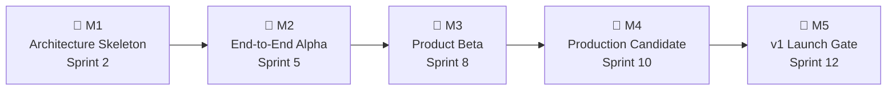
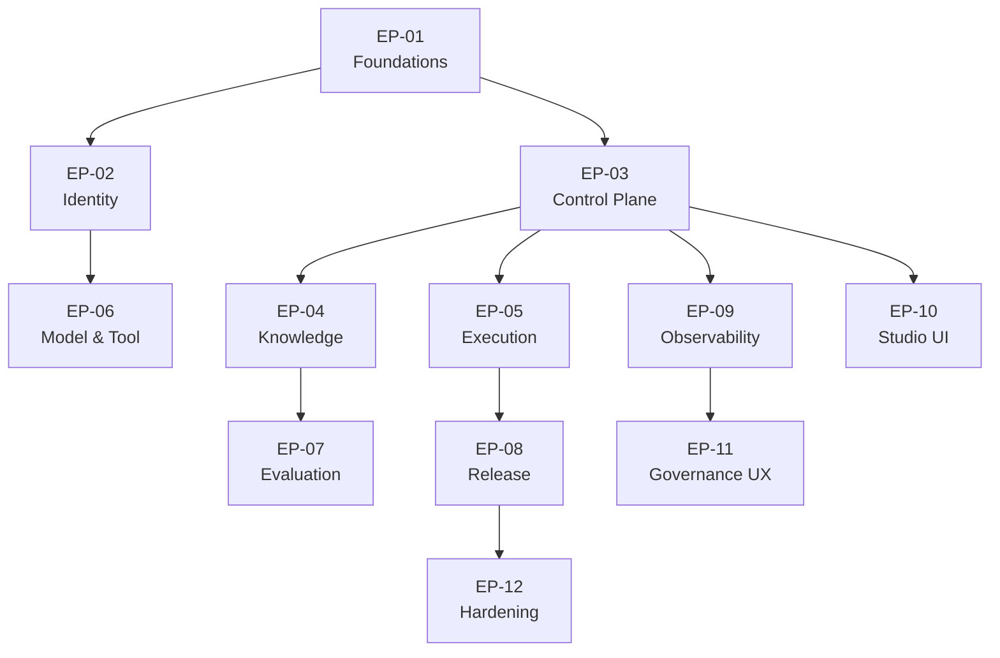

# Agent Architect Pro — Roadmap Deep Dive

> Complete breakdown of 12 epics × 13 sprints, 99 Jira tickets, 5 milestone gates, dependency chains, team capacity, and delivery risks.

---

## Delivery Framing

| Parameter | Value |
|-----------|-------|
| **Horizon** | 12 sprints (~24 weeks) |
| **Sprint cadence** | 2-week sprints |
| **Method** | Architecture-first scaffolding → product workflows → hardening & rollout |
| **Release target** | Stable v1: agent creation, governed execution, evaluation, deployment, runtime monitoring |
| **Planning model** | One cross-functional platform squad + shared design/ML support |

> [!IMPORTANT]
> High-risk research features (advanced debate search, self-evolution, agent economy) are **explicitly excluded** from the v1 critical path.

---

## 12 Epics

```mermaid
gantt
    title Epic Timeline (Sprint 0 → Sprint 12)
    dateFormat X
    axisFormat Sprint %s

    section Infrastructure
    EP-01 Foundations & DevEx        :ep1, 0, 2
    EP-02 Identity, Auth & Policy   :ep2, 1, 3

    section Core Platform
    EP-03 Control Plane Core        :ep3, 1, 4
    EP-04 Knowledge Plane           :ep4, 2, 4
    EP-05 Execution Plane           :ep5, 3, 4
    EP-06 Model & Tool Access       :ep6, 3, 4

    section Quality & Release
    EP-07 Evaluation & Simulation   :ep7, 5, 4
    EP-08 Release, Deploy & Envs    :ep8, 6, 4
    EP-09 Observability & Audit     :ep9, 2, 7

    section Product
    EP-10 Studio & Workflow UI      :ep10, 4, 7
    EP-11 Governance & Executive UX :ep11, 8, 3

    section Launch
    EP-12 Hardening & Launch        :ep12, 10, 3
```



| Epic ID | Name | Outcome | Owner | Sprint Window | Priority |
|---------|------|---------|-------|--------------|----------|
| **EP-01** | Platform Foundations & DevEx | Repo, standards, CI baseline, environments, secrets, coding conventions | Platform | S0-S1 | 🔴 Critical |
| **EP-02** | Identity, Auth & Policy | Tenant auth, workload tokens, RBAC, policy bundles, audit hooks | Security | S1-S3 | 🔴 Critical |
| **EP-03** | Control Plane Core | API Gateway, Supervisor, Planner, run lifecycle, run state | Backend | S1-S4 | 🔴 Critical |
| **EP-04** | Knowledge Plane | Retrieval, artifact catalog, episodic memory, indexing | ML Platform | S2-S5 | 🟡 High |
| **EP-05** | Execution Plane | Swarm scheduling, runtime manager, sandbox executor, result aggregation | Platform | S3-S6 | 🔴 Critical |
| **EP-06** | Model & Tool Access | Model gateway, tool broker, usage policy, quota enforcement | Platform | S3-S6 | 🔴 Critical |
| **EP-07** | Evaluation & Simulation | Benchmarking, replay, simulation, quality evidence | ML Eng | S5-S8 | 🟡 High |
| **EP-08** | Release, Deployment & Environments | Artifact signing, release manager, canary, rollback | DevOps | S6-S9 | 🟡 High |
| **EP-09** | Observability & Audit | Metrics, logs, traces, audit ledger, dashboards | SRE | S2-S8 | 🔴 Critical |
| **EP-10** | Studio & Workflow UI | Brief builder, architecture compare, evaluation lab, release center | Frontend | S4-S10 | 🟡 High |
| **EP-11** | Governance & Executive UX | Approvals, incidents, audit view, executive portfolio | Frontend | S8-S10 | 🟢 Medium |
| **EP-12** | Hardening, Performance & Launch | Load tests, threat model remediation, cutover, runbooks | Cross-functional | S10-S12 | 🔴 Critical |

---

## 5 Milestone Gates



| Milestone | Sprint | Definition of Done | Success Metric |
|-----------|--------|-------------------|----------------|
| **M1 — Architecture Skeleton** | S2 | Repos, environments, CI/CD, auth shell, contracts, telemetry bootstrap, ADRs locked | Contracts, auth, and observability bootstrap reviewed and approved |
| **M2 — End-to-End Alpha** | S5 | One agent workflow: intake → plan → run → retrieve → respond → audit | One end-to-end vertical slice with auditable execution |
| **M3 — Product Beta** | S8 | Primary UI flows function; evaluation + release center exist; staging active | Product beta supports primary journey without CLI dependence |
| **M4 — Production Candidate** | S10 | Canary release, rollback, hardening, observability complete; acceptance tests passing | Can deploy to canary with automated rollback |
| **M5 — v1 Launch Gate** | S12 | Pilot tenants onboarded, runbooks signed off, phase-2 backlog prioritized | Pilot users create, evaluate, deploy, and monitor agents via UI |

---

## Sprint-by-Sprint Breakdown (S0–S12)

### Phase 1: Foundation (Sprints 0–2) → Milestone M1

| Sprint | Theme | Primary Epics | Key Deliverables | Exit Criteria |
|--------|-------|--------------|------------------|---------------|
| **S0** | Platform bootstrap | EP-01 | Monorepo, branching strategy, CI templates, container base images, local dev stack, OTel bootstrap, design-system shell | Repos live; CI green; local stack runs; UI shell in place |
| **S1** | Identity + run bootstrap | EP-02, EP-03 | RunSpec/PlanSpec/TaskSpec schemas, API gateway shell, user auth, RBAC roles, secrets flow, ADR set | Versioned contracts approved; auth works; secrets path validated |
| **S2** | Planner + observability baseline | EP-03, EP-09 | Supervisor state machine, Planner stub, PostgreSQL schema, run tracking, mocked model gateway, first brief-to-plan flow | A run can be created and planned with persisted state |

### Phase 2: Core Platform (Sprints 3–5) → Milestone M2

| Sprint | Theme | Primary Epics | Key Deliverables | Exit Criteria |
|--------|-------|--------------|------------------|---------------|
| **S3** | Execution plane alpha | EP-05, EP-06 | Swarm queueing, runtime manager, sandbox policy skeleton, Tool Broker MVP, audit event emission, worker heartbeats | A task executes in controlled runtime and records audit events |
| **S4** | Knowledge + Studio foundations | EP-04, EP-10 | Retrieval service, pgvector indexing, artifact catalog MVP, model gateway MVP, Home + Studio shell, run list | Vertical slice: intake → response with retrieval + telemetry |
| **S5** | Retrieval + E2E alpha | EP-04, EP-07 | End-to-end request flow in staging-lite, benchmark harness, EvaluationReport schema, replay harness | **M2: One vertical slice works end-to-end** |

### Phase 3: Product Workflows (Sprints 6–8) → Milestone M3

| Sprint | Theme | Primary Epics | Key Deliverables | Exit Criteria |
|--------|-------|--------------|------------------|---------------|
| **S6** | Studio + Runtime UI | EP-07, EP-08 | Home, Studio shell, run list, runtime overview, API integration, design tokens finalized, basic approval state | Users create and inspect runs via product UI |
| **S7** | Evaluation foundations | EP-07, EP-09 | Benchmark harness, replay harness, basic canary packaging, release diff UI, trace drill-down, alerting | Candidates evaluated and compared against baseline |
| **S8** | Beta workflow complete | EP-05, EP-07, EP-08, EP-11 | Evaluation Lab UI, Release Center, staging hardening, policy checks, episodic memory MVP, approval queues, audit surfaces | **M3: Primary v1 workflow in staging with approvals** |

### Phase 4: Hardening (Sprints 9–10) → Milestone M4

| Sprint | Theme | Primary Epics | Key Deliverables | Exit Criteria |
|--------|-------|--------------|------------------|---------------|
| **S9** | Security + resilience | EP-02, EP-04, EP-09 | Vault integration, signed artifacts, network policies, rate limits, retry policies, queue backpressure | Threat model actions closed; runtime + release controls hardened |
| **S10** | Observability + canary | EP-09, EP-11, EP-12 | Dashboards, alert rules, SLOs, canary/rollback automation, on-call runbooks, incident drills, portfolio dashboard | **M4: Production canary executable safely in pre-prod** |

### Phase 5: Launch (Sprints 11–12) → Milestone M5

| Sprint | Theme | Primary Epics | Key Deliverables | Exit Criteria |
|--------|-------|--------------|------------------|---------------|
| **S11** | Pilot launch prep | EP-07, EP-09, EP-12 | Pilot tenant config, support playbooks, UAT, data retention policies, cost dashboards, defect burn-down | Pilot tenants ready; no sev-1 launch blockers |
| **S12** | Launch + stabilization | All epics | Pilot release, hypercare, post-launch backlog capture, phase-2 prioritization, final architecture review | **M5: Pilot live, monitored, and governed** |

---

## Ticket Inventory (99 Total)

### Ticket Composition

| Type | Count | Story Points |
|------|-------|-------------|
| **Epics** | 12 | — |
| **Stories** | 72 (6 per epic × 12 epics) | 348 SP |
| **Tasks** | 24 (2 per epic × 12 epics) | 60 SP |
| **Spikes** | 3 | 15 SP |
| **Total** | **99** | **~456 SP** |

### Repeating Story Pattern (per Epic)

Each epic follows a consistent **8-ticket pattern** (6 stories + 2 tasks):

| # | Ticket | Type | Points | Purpose |
|---|--------|------|--------|---------|
| 1 | `EP-XX-ST-01` | Story | 3 SP | **Define contract and ADRs** — create detailed contracts, ADRs, coding conventions |
| 2 | `EP-XX-ST-02` | Story | 5 SP | **Implement service skeleton** — repo/module, health checks, config, CI integration |
| 3 | `EP-XX-ST-03` | Story | 8 SP | **Implement primary endpoint/worker flow** — main functional path with tests + tracing |
| 4 | `EP-XX-ST-04` | Story | 5 SP | **Add policy, validation, error handling** — guardrails, validation, standard error envelope |
| 5 | `EP-XX-ST-05` | Story | 3 SP | **Add observability and audit hooks** — logs, traces, metrics, audit events |
| 6 | `EP-XX-ST-06` | Story | 5 SP | **Integration and demo readiness** — integrate with dependent services, demo evidence |
| 7 | `EP-XX-TS-01` | Task | 3 SP | **Test automation** — unit, integration, and contract tests |
| 8 | `EP-XX-TS-02` | Task | 2 SP | **Documentation** — service README, runbook, handoff notes |

> Total per epic: **34 story points**

### 3 Spikes

| ID | Name | Sprint | Points | Depends On | Output |
|----|------|--------|--------|-----------|--------|
| **SPIKE-01** | Model route policy benchmark | S3 | 5 SP | EP-03-ST-03 | Benchmark report with latency/cost tier recommendation |
| **SPIKE-02** | Threat model workshop | S2 | 5 SP | EP-02-ST-02 | Threat model documented with remediation backlog |
| **SPIKE-03** | Load test design | S10 | 5 SP | EP-05-ST-06 | Approved performance test plan |

---

## All 99 Tickets by Sprint

### Sprint 0 (8 tickets, 34 SP)
| ID | Summary | Type | SP | Owner |
|----|---------|------|-----|-------|
| EP-01-ST-01 | Foundations: Define contract and ADRs | Story | 3 | Tech Lead |
| EP-01-ST-02 | Foundations: Implement service skeleton | Story | 5 | Tech Lead |
| EP-01-ST-03 | Foundations: Implement primary endpoint/worker flow | Story | 8 | Tech Lead |
| EP-01-ST-04 | Foundations: Add policy, validation, error handling | Story | 5 | Tech Lead |
| EP-01-ST-05 | Foundations: Add observability and audit hooks | Story | 3 | Tech Lead |
| EP-01-ST-06 | Foundations: Integration and demo readiness | Story | 5 | Tech Lead |
| EP-01-TS-01 | Foundations: Test automation | Task | 3 | QA Engineer |
| EP-01-TS-02 | Foundations: Documentation | Task | 2 | Tech Writer |

### Sprint 1 (16 tickets, 68 SP)
| ID | Summary | Type | SP | Owner |
|----|---------|------|-----|-------|
| EP-02-ST-01 to ST-06 | Identity, Auth & Policy: full story set | 6 Stories | 29 | Security Eng |
| EP-02-TS-01, TS-02 | Identity: Tests + Docs | 2 Tasks | 5 | QA + Writer |
| EP-03-ST-01 to ST-06 | Control Plane: full story set | 6 Stories | 29 | Backend Eng |
| EP-03-TS-01, TS-02 | Control Plane: Tests + Docs | 2 Tasks | 5 | QA + Writer |

### Sprint 2 (9 tickets, 37 SP)
| ID | Summary | Type | SP | Owner |
|----|---------|------|-----|-------|
| EP-09-ST-01 to ST-06 | Observability & Audit: full story set | 6 Stories | 29 | SRE |
| EP-09-TS-01, TS-02 | Observability: Tests + Docs | 2 Tasks | 5 | QA + Writer |
| SPIKE-02 | Threat model workshop | Spike | 5 | Security Eng |

### Sprint 3 (17 tickets, 73 SP)
| ID | Summary | Type | SP | Owner |
|----|---------|------|-----|-------|
| EP-05-ST-01 to ST-06 | Execution Plane: full story set | 6 Stories | 29 | Platform Eng |
| EP-05-TS-01, TS-02 | Execution: Tests + Docs | 2 Tasks | 5 | QA + Writer |
| EP-06-ST-01 to ST-06 | Model & Tool Access: full story set | 6 Stories | 29 | Platform Eng |
| EP-06-TS-01, TS-02 | Model/Tool: Tests + Docs | 2 Tasks | 5 | QA + Writer |
| SPIKE-01 | Model route policy benchmark | Spike | 5 | ML Engineer |

### Sprint 4 (16 tickets, 68 SP)
| ID | Summary | Type | SP | Owner |
|----|---------|------|-----|-------|
| EP-04-ST-01 to ST-06 | Knowledge Plane: full story set | 6 Stories | 29 | ML Engineer |
| EP-04-TS-01, TS-02 | Knowledge: Tests + Docs | 2 Tasks | 5 | QA + Writer |
| EP-10-ST-01 to ST-06 | Studio & Workflow UI: full story set | 6 Stories | 29 | Frontend Eng |
| EP-10-TS-01, TS-02 | Studio UI: Tests + Docs | 2 Tasks | 5 | QA + Writer |

### Sprint 5 (8 tickets, 34 SP)
| ID | Summary | Type | SP | Owner |
|----|---------|------|-----|-------|
| EP-07-ST-01 to ST-06 | Evaluation & Simulation: full story set | 6 Stories | 29 | ML Engineer |
| EP-07-TS-01, TS-02 | Evaluation: Tests + Docs | 2 Tasks | 5 | QA + Writer |

### Sprint 6 (8 tickets, 34 SP)
| ID | Summary | Type | SP | Owner |
|----|---------|------|-----|-------|
| EP-08-ST-01 to ST-06 | Release, Deploy & Envs: full story set | 6 Stories | 29 | DevOps Eng |
| EP-08-TS-01, TS-02 | Release: Tests + Docs | 2 Tasks | 5 | QA + Writer |

### Sprint 8 (8 tickets, 34 SP)
| ID | Summary | Type | SP | Owner |
|----|---------|------|-----|-------|
| EP-11-ST-01 to ST-06 | Governance & Executive UX: full story set | 6 Stories | 29 | Frontend Eng |
| EP-11-TS-01, TS-02 | Governance UI: Tests + Docs | 2 Tasks | 5 | QA + Writer |

### Sprint 10 (9 tickets, 39 SP)
| ID | Summary | Type | SP | Owner |
|----|---------|------|-----|-------|
| EP-12-ST-01 to ST-06 | Hardening & Launch: full story set | 6 Stories | 29 | Tech Lead |
| EP-12-TS-01, TS-02 | Hardening: Tests + Docs | 2 Tasks | 5 | QA + Writer |
| SPIKE-03 | Load test design | Spike | 5 | SRE |

---

## Dependency Chain



| Dep ID | From → To | Reason | Mitigation |
|--------|-----------|--------|------------|
| **DEP-01** | EP-03 → EP-02 | Run creation requires tenant/workload auth flows | Deliver token service skeleton in Sprint 1 before integration |
| **DEP-02** | EP-05 → EP-03 | Swarm execution depends on TaskSpec contract and run state model | Freeze TaskSpec contract before execution alpha |
| **DEP-03** | EP-06 → EP-02 | Tool and model access requires policy enforcement and grants | Complete policy engine rules before beta |
| **DEP-04** | EP-08 → EP-07 | Promotion decisions require evaluation evidence | Tie release gate to EvaluationReport availability |
| **DEP-05** | EP-10 → EP-03 | Studio UX depends on run and plan APIs being stable | Use mocked contracts until backend v1 fields freeze |
| **DEP-06** | EP-11 → EP-09 | Governance surfaces depend on audit and observability payloads | Provide query APIs and field-level docs by Sprint 8 |

### Critical Path
```
EP-01 → EP-03 → EP-05 → EP-08 → EP-12 → Launch
         ↓
         EP-04 → EP-07 ──↗
```

---

## Team Capacity Model

| Role | FTE Allocation | Sprint Focus |
|------|---------------|-------------|
| **Tech Lead / Chief Architect** | 0.5–1.0 FTE | All sprints — ADRs, review gates, risk removal |
| **Backend / Platform Engineers** | 3–4 FTE | S0-S9 — control, execution, auth, release, data services |
| **Frontend Engineers** | 1–2 FTE → 2 FTE | S1 onward; scaling from S5-S10 for Studio + Governance |
| **ML / AI Engineer** | 1–2 FTE | S3-S10 — model gateway, retrieval, evaluation, prompt/policy testing |
| **SRE / DevOps** | 1 FTE shared | All sprints; heavier from S7 for staging, production, reliability |
| **Product Design** | 0.5–1.0 FTE | Front-loaded for Studio, Evaluation, Release, Runtime |
| **QA / Test Automation** | 0.5–1.0 FTE | From S4 onward; heavier from S7 |

---

## Quality Gates by Phase

| Phase End | Required Gate |
|-----------|--------------|
| **Sprint 2** | Contracts, auth, and observability bootstrap **reviewed and approved** |
| **Sprint 5** | Vertical slice demo: brief → plan → run → retrieve → respond → audit |
| **Sprint 8** | Beta gate: product workflow complete in staging; **no critical policy bypasses** |
| **Sprint 10** | Production candidate gate: canary/rollback validated, SLOs and alerts active |
| **Sprint 12** | Launch gate: pilot success metrics agreed, support process staffed, risks accepted |

---

## Area-Level Acceptance Criteria

| Area | Definition of Done |
|------|-------------------|
| **Control Plane** | Run lifecycle, state transitions, retries, and cancellation behave per contract pack with test evidence |
| **Execution Plane** | Workers accept, execute, checkpoint, and complete tasks with trace + audit correlation |
| **Knowledge Plane** | Retrieval results are permission-aware, ranked, and traceable to source references |
| **Security** | All privileged flows use short-lived tokens; no direct raw credential use in workers |
| **Release** | Only signed, evaluated candidates can be promoted; rollback path is tested |
| **UI** | Studio, Evaluation, and Release surfaces work against documented APIs without undocumented fields |
| **Operations** | Metrics, logs, traces, and audit data visible in dashboards and incident workflows |

---

## Delivery Risks

| Risk | Likelihood | Impact | Mitigation |
|------|-----------|--------|------------|
| **Architecture churn mid-build** | Medium | 🔴 High | Freeze contracts early; route design changes through ADR review |
| **UI blocked by unstable APIs** | High | 🟡 Medium | Use API mocks and adapter layers; define schemas first |
| **Ops work delayed until late** | Medium | 🔴 High | Staff SRE from start; require telemetry in every story |
| **Model/tool provider volatility** | Medium | 🟡 Medium | Abstract behind Model Gateway + Tool Broker from day one |
| **Scope creep from research features** | High | 🔴 High | Strict v1 scope; park phase-2 features outside sprint commitment |

---

## v1 Scope Boundary

| ✅ In Scope | ❌ Deferred to Phase 2+ |
|------------|------------------------|
| Brief intake, planning | Advanced self-evolution |
| Controlled runtime execution | Autonomous architecture search |
| Retrieval, model gateway | Agent economy |
| Evaluation summary | Broad cross-tenant portfolio analytics |
| Release center, canary rollout | Full mobile authoring |
| Runtime monitoring, audit trail | Unbounded autonomous behavior |

---

## Backlog Stories per Epic

| Epic | Suggested Work Packages |
|------|------------------------|
| **EP-01** | Repo templates; IaC baselines; CI checks; dependency scanning; local dev stack; contract testing harness |
| **EP-02** | OIDC login; RBAC model; policy store; secrets integration; audit record shape; approval workflow primitives |
| **EP-03** | Run creation API; Supervisor lifecycle; Planner logic; budget enforcement; release-state transitions |
| **EP-04** | Vector ingestion; retrieval/rerank API; artifact catalog; episode writer; source evidence packaging |
| **EP-05** | Queue model; runtime instance API; sandbox controls; Tool Broker adapters; result aggregator |
| **EP-06** | Provider abstraction; caching; quota rules; telemetry envelopes; fallback policy |
| **EP-07** | Benchmark packs; replay jobs; simulation harness; verdict service; candidate comparison reports |
| **EP-08** | Canary automation; rollback; SLO dashboards; incident runbooks; load and security tests |
| **EP-09** | OTel collectors; metrics/logs/traces routing; alerting; audit ledger; dashboards |
| **EP-10** | Navigation shell; Studio; Evaluation Lab; Release Center; Runtime Overview; design system buildout |
| **EP-11** | Approval queue; audit timeline; governance center; executive portfolio |
| **EP-12** | Load tests; threat model remediation; cutover; runbooks; incident drills |
