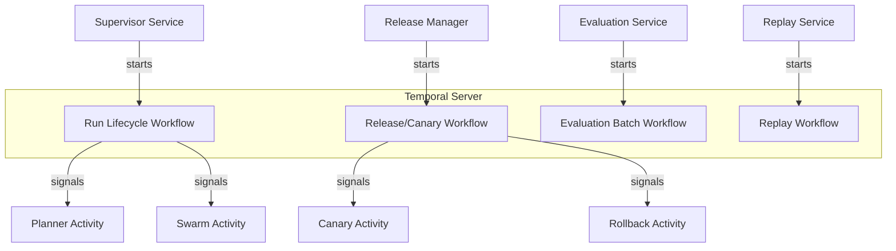

# Agent Architect Pro — Technology Stack Deep Dive

> Complete breakdown of every technology choice, per-service stack assignments, protocol decisions, data strategy, deployment topology, and development environment.

---

## Stack Strategy

> **Choose boring, durable platform technologies for the online path; isolate experimental AI capabilities to the improvement plane.**

The project explicitly recommends against tech sprawl. The principle is **PostgreSQL-first** — keep operational state, vectors, and relational joins close together before introducing specialized databases.

---

## 1. Frontend Layer

### Next.js + TypeScript

| Attribute | Detail |
|-----------|--------|
| **Framework** | Next.js (React) |
| **Language** | TypeScript (strict mode) |
| **Styling** | Tailwind CSS |
| **Component Library** | shadcn/ui (enterprise-grade primitives) |
| **Data Fetching** | TanStack Query (React Query) |
| **State Management** | Zustand or Redux Toolkit |
| **Component Docs** | Storybook |
| **Rendering** | Server/client rendering balance (SSR for initial load, CSR for interactive) |

**Why Next.js?** The platform has complex enterprise UX needs — authenticated dashboards, design system reuse, lifecycle-driven workflows with 30+ screens. Next.js provides:
- Server-side rendering for fast first paint on dense data screens
- API routes for BFF (Backend-for-Frontend) pattern
- Built-in image optimization and code splitting
- Strong TypeScript integration for typed contracts

### Frontend Service: `api-gateway / web-bff`

```
Responsibility: Authentication handoff, tenant context, API aggregation,
               rate limiting, UI support
Stack:          TypeScript / Node.js OR managed API gateway + Next.js BFF
```

---

## 2. Backend API Layer

### Python 3.12+ / FastAPI / Pydantic v2

| Attribute | Detail |
|-----------|--------|
| **Language** | Python 3.12+ |
| **Framework** | FastAPI |
| **Schema/Validation** | Pydantic v2 |
| **Server** | Uvicorn / Gunicorn |
| **Contract Generation** | Auto-generated OpenAPI specs from Pydantic models |

**Why FastAPI + Pydantic?**
- **Typed contracts** — Pydantic v2 generates and enforces schemas automatically
- **OpenAPI-first** — every endpoint auto-generates documentation
- **Python AI ecosystem** — matches model libs, Temporal SDK, evaluation frameworks
- **Performance** — FastAPI on Uvicorn is one of the fastest Python web frameworks
- **Developer experience** — async support, dependency injection, auto-validation

### Per-Service Stack Mapping

| Service | Language | Framework | Key Libraries |
|---------|----------|-----------|---------------|
| `supervisor-service` | Python | FastAPI | Temporal SDK, Pydantic v2, SQLAlchemy |
| `planner-service` | Python | FastAPI | Pydantic v2, model gateway client |
| `retrieval-service` | Python | FastAPI | pgvector, reranker models, object storage SDK |
| `tool-broker` | Python or Go | FastAPI / net/http | Vault SDK, audit hooks |
| `runtime-worker` | Python | Worker service | Temporal worker SDK, model clients |
| `evaluation-service` | Python | FastAPI | pytest, custom eval harnesses, MLflow |
| `identity/audit-service` | Go or Python | FastAPI / Gin | JWT libs, hash-chain logic |
| `model-gateway` | Python or Go | FastAPI / Gin | Provider adapters (OpenAI, Anthropic, etc.) |
| `release-manager` | Python | FastAPI | Temporal SDK, artifact registry client |

### API Protocol Rules

```
┌─────────────────────────────────────────────────────────┐
│  Transport:  JSON over HTTPS (public/service APIs)      │
│              gRPC for high-throughput service-to-service │
│  Versioning: URI major: /v1/...                         │
│              Additive changes OK within v1              │
│              Breaking changes → /v2                     │
│  Auth:       Bearer token (JWT) on all privileged calls │
│  Idempotency: POST state changes require                │
│               Idempotency-Key or client_request_id      │
│  Tracing:    Every request carries trace_id, run_id,    │
│              task_attempt_id                            │
│  Errors:     Standard error envelope with code, message,│
│              retryability, correlation_id, violations   │
│  TLS:        Everywhere. Internal mTLS via service mesh │
│  Schema:     Additive-only within v1. Consumers MUST    │
│              ignore unknown fields                      │
└─────────────────────────────────────────────────────────┘
```

### Standard Request Envelope
```json
{
  "request_meta": {
    "tenant_id": "tenant-acme",
    "trace_id": "trc_01H...",
    "client_request_id": "req_123",
    "actor_id": "usr_456",
    "policy_profile": "enterprise-strict",
    "requested_by_role": "builder"
  }
}
```

### Standard Error Envelope
```json
{
  "status": "error",
  "error": {
    "code": "POLICY_VIOLATION",
    "message": "Tool call blocked by policy.",
    "retryable": false,
    "correlation_id": "corr_789",
    "details": {
      "policy_rule": "TOOL.RESTRICTED.NETWORK",
      "violations": [
        {"field": "tool_name", "reason": "blocked"}
      ]
    }
  }
}
```

### Error Code Table

| Code | HTTP | Meaning | Retryable? |
|------|------|---------|------------|
| `VALIDATION_FAILED` | 400 | Input payload/field rules failed | No |
| `AUTHN_REQUIRED` | 401 | Missing or invalid credentials | No |
| `AUTHZ_DENIED` | 403 | Caller lacks rights or tool grant | No |
| `NOT_FOUND` | 404 | Run/plan/token/artifact not found | No |
| `CONFLICT` | 409 | State transition or idempotency mismatch | Maybe |
| `RATE_LIMITED` | 429 | Quota exceeded | Yes |
| `UPSTREAM_TIMEOUT` | 504 | Model route or service timeout | Yes |

---

## 3. Workflow & Orchestration

### Temporal

| Attribute | Detail |
|-----------|--------|
| **Role** | Durable long-running workflow orchestration |
| **Used By** | Supervisor, Release Manager, Swarm Orchestrator, Evaluation/Replay |
| **Key Benefits** | Retry logic, resumability, visibility, separation of workflow state from worker execution |

**Why Temporal instead of hand-rolled state machines?**
- Agent operations are **long-running** (minutes to hours) — Temporal handles timeouts and retries durably
- **Crash recovery** — workflows resume exactly where they left off after process restarts
- **Visibility** — built-in UI for workflow state, task queues, and execution history
- **Activity isolation** — separates side-effects (API calls, DB writes) from orchestration logic
- **Saga patterns** — clean compensation logic for rollbacks and cancellations

### How Temporal Maps to Services



| Workflow | Purpose | Triggers |
|----------|---------|----------|
| **Run Lifecycle** | Manages run from creation → planning → execution → completion/failure | `POST /v1/runs` |
| **Release/Canary** | Orchestrates promotion, canary monitoring, rollback | `POST /v1/releases/promote` |
| **Evaluation Batch** | Runs benchmark suites, safety checks, regression tests | `POST /v1/evaluations/candidates` |
| **Replay** | Replays historical traffic against new candidate | Internal trigger |

---

## 4. Event Streaming

### Apache Kafka

| Attribute | Detail |
|-----------|--------|
| **Role** | Reliable domain-event backbone |
| **Alternative** | Redpanda (simpler ops in some environments) |
| **Used For** | Swarm events, audit streams, telemetry fan-out, async integrations |
| **Interface** | Kafka topics with JSON payloads |

**Why Kafka?**
- **Durability** — events persist; consumers can replay from any offset
- **Decoupling** — producers and consumers are independent (audit ledger doesn't slow down the run)
- **Fan-out** — a single event can be consumed by multiple services (observability, audit, analytics)
- **Ordering** — partition-key ordering for per-run event sequences

### Event Topic Map

| Topic | Producer | Consumer(s) | Purpose |
|-------|----------|------------|---------|
| `run.created` | Supervisor | Planner, Observability | Lifecycle start signal |
| `plan.ready` | Planner | Supervisor | Task DAG compiled |
| `task.submitted` | Supervisor | Swarm | Runnable task for scheduling |
| `task.completed` | Runtime Worker | Supervisor, Aggregator | Task result available |
| `episode.written` | Episodic Memory | Retrieval, Analytics | Reusable learning artifact |
| `audit.event` | All privileged services | Audit Ledger | Append-only evidence |
| `eval.completed` | Evaluation Service | Release Manager | Candidate evaluation evidence |
| `release.promoted` | Release Manager | Observability, Dashboard | Deployment state change |

### Sample Event Payload (`task.completed`)
```json
{
  "topic": "task.completed",
  "event_version": "1.0",
  "event_id": "evt_01J...",
  "trace_id": "trc_01H...",
  "run_id": "run_01J...",
  "task_attempt_id": "ta_456",
  "producer": "runtime-worker",
  "occurred_at": "2026-03-22T10:33:00Z",
  "payload": {
    "task_id": "t3",
    "status": "succeeded",
    "outputs": {"artifact_refs": ["cand_001"]},
    "cost_usd": 1.42,
    "latency_ms": 4820
  }
}
```

---

## 5. Primary Database

### PostgreSQL 16+

| Attribute | Detail |
|-----------|--------|
| **Role** | System of record for all operational state |
| **Deployment** | Managed service preferred (AWS RDS, Cloud SQL, etc.) |
| **Migrations** | Flyway or Alembic with strict migration discipline |
| **Extensions** | pgvector for embeddings |

**Why PostgreSQL-first?**
- **Single source of truth** — runs, plans, approvals, identities, manifests, governance state all in one transactional store
- **pgvector** — embeddings live alongside metadata with SQL joins and ACID guarantees
- **Simplicity** — avoid multi-database sprawl in v1
- **Ecosystem** — mature tooling, managed services everywhere, excellent Python/SQLAlchemy support

### What Lives in PostgreSQL

| Data Domain | Tables/Schemas | Notes |
|-------------|---------------|-------|
| **Run state** | runs, plans, tasks, task_attempts | System of record; transactional |
| **Identity** | agent_specs, agent_versions, runtime_instances | Strict migration discipline |
| **Approvals** | approval_packets, signatures, release_decisions | Governance state |
| **Audit** | audit_events (append-only, hash-chained) | May migrate to ClickHouse at high volume |
| **Policy** | policy_bundles, tenant_policies, tool_grants | Rule definitions |
| **Vectors** | embeddings (via pgvector), source_records | Exact search initially → ANN indexes |

---

## 6. Vector & Retrieval

### PostgreSQL + pgvector

| Attribute | Detail |
|-----------|--------|
| **Extension** | pgvector (built into PostgreSQL) |
| **Initial Strategy** | Exact search (IVFFlat or HNSW indexes later) |
| **Scale Path** | Add ANN indexes as corpus grows; optional specialized vector engine later |
| **Reranker** | Reranker model (cross-encoder) as a separate service |

**Why pgvector over a dedicated vector DB?**
- Embeddings sit **alongside relational metadata** — filtering by tenant, tags, freshness uses standard SQL
- **ACID joins** — combine vector similarity with permission checks in a single query
- **Simpler ops** — one fewer database to manage, back up, and secure
- **Good enough for v1** — exact search handles early/mid-scale corpus

### Retrieval Stack
```
PostgreSQL + pgvector (embeddings + metadata)
    ↓
Reranker Model (cross-encoder for relevance)
    ↓
S3-compatible Object Storage (full documents)
    ↓
Retrieval Service API (FastAPI)
```

---

## 7. Caching & Coordination

### Redis

| Attribute | Detail |
|-----------|--------|
| **Role** | Low-latency cache, rate-limit counters, distributed locks, ephemeral coordination |
| **What It Stores** | Hot metadata, session acceleration, short-lived state |
| **Hard Rule** | **No durable system-of-record data** — Redis is ephemeral only |

---

## 8. Object Storage

### S3-Compatible Storage

| Attribute | Detail |
|-----------|--------|
| **Role** | Binary artifact storage |
| **Stores** | Versioned artifacts, evaluation bundles, documents, exported reports, trace exports, large evaluation outputs |
| **Rule** | Version every artifact; keep release manifests **immutable** |

---

## 9. Container & Platform

### Kubernetes + Docker + Helm + Argo CD

| Technology | Role |
|-----------|------|
| **Docker** | Container packaging — all services ship as images |
| **Kubernetes** | Scheduling, self-healing, autoscaling, isolation |
| **Helm** | Templated deployment configurations |
| **Argo CD** | GitOps-based declarative deployments and promotion |

### How Kubernetes Is Used

| K8s Feature | Used For |
|-------------|---------|
| **Deployments** | Control plane services (Supervisor, Planner, etc.) |
| **Jobs/Pods** | Runtime workers (sandboxed execution) |
| **Namespaces** | Environment isolation (dev, staging, prod) |
| **NetworkPolicies** | Sandbox egress control |
| **ServiceAccounts** | Isolated worker identities |
| **Seccomp profiles** | Sandbox security hardening |
| **HPA** | Autoscaling workers independently from control APIs |
| **Resource Quotas** | CPU/memory limits for sandboxed execution |

### Sandbox Isolation Stack
```
Kubernetes Pod
  ├── Container Policies (restricted)
  ├── Network Policies (egress control)
  ├── Seccomp Profile (syscall filtering)
  ├── Resource Quotas (CPU/memory limits)
  ├── Isolated ServiceAccount (no cluster-level access)
  └── No raw credentials (token injection via Token Service)
```

---

## 10. Identity & Access

### Keycloak / Cloud OIDC + OPA/Cedar

| Technology | Role |
|-----------|------|
| **Keycloak** (or Auth0) | OIDC/OAuth2 provider for human SSO and service identity |
| **OPA or Cedar** | Policy enforcement engine for RBAC/ABAC rules |
| **Vault** | Secret management, credential brokering |
| **KMS/HSM** | Artifact signing keys |

### Token Flow
```
Human User → Keycloak (OIDC) → JWT with role claims
                                     ↓
Runtime Worker → Token Service → Short-lived workload token
                                     ↓
Tool Call → Tool Broker → Vault (credential injection) → External API
                                     ↓
                             Audit Event emitted
```

---

## 11. Observability Stack

### OpenTelemetry + Prometheus + Grafana + Loki + Tempo

| Technology | Role | Data Type |
|-----------|------|-----------|
| **OpenTelemetry** | Vendor-neutral instrumentation SDK + collectors | All signals |
| **Prometheus** | Metrics storage and alerting | `MetricsSeries` |
| **Grafana** | Dashboards and visualization | All signals |
| **Loki** | Log aggregation and search | `StructuredLogs` |
| **Tempo** (or Jaeger) | Distributed trace storage | `TraceSpans` |

**Why OpenTelemetry-centric?**
- **Unified instrumentation** — one SDK for traces, metrics, and logs across frontend, backend, and workers
- **Vendor-neutral** — swap backends without changing application code
- **Correlation** — `run_id` and `task_attempt_id` flow through all signals as first-class keys
- **Ecosystem** — wide language support (Python, TypeScript, Go)

### Correlation ID Flow
```
Every request carries:
  ├── trace_id    (distributed tracing)
  ├── run_id      (business correlation)
  └── task_attempt_id  (execution correlation)

These IDs appear in:
  ├── HTTP headers
  ├── Kafka event payloads
  ├── Log structured fields
  ├── Trace span attributes
  └── Audit event records
```

---

## 12. CI/CD & Release Pipeline

### GitHub Actions + Argo CD + Trivy + Cosign

| Technology | Role |
|-----------|------|
| **GitHub Actions** (or GitLab CI) | Automated build, test, lint, type-check |
| **Trivy** | Container vulnerability scanning |
| **Cosign** | Image and artifact signing |
| **SBOM generation** | Software bill of materials |
| **Argo CD** | GitOps deployment promotion |

### Pipeline Flow


---

## 13. ML / Evaluation Stack

### MLflow + pytest + Custom Harnesses

| Technology | Role |
|-----------|------|
| **MLflow** | Experiment tracking (not production serving) |
| **pytest** | Test framework for eval harnesses |
| **Custom eval harnesses** | Benchmark suites, adversarial tests, regression checks |
| **Jupyter** | Research only — **not production** |

> [!WARNING]
> Clear boundary: MLflow and Jupyter are for **experimentation/research only**. Production evaluation is run through the Evaluation Service with Temporal orchestration.

---

## 14. Complete Per-Service Technology Matrix

| # | Service | Plane | Language | Framework | Database | Messaging | Orchestration |
|---|---------|-------|----------|-----------|----------|-----------|--------------|
| 1 | API Gateway | Control | — | Kong/NGINX | — | — | — |
| 2 | Auth Service | Control | — | Keycloak | — | — | — |
| 3 | Supervisor | Control | Python | FastAPI | PostgreSQL | Kafka producer | Temporal client |
| 4 | Planner | Control | Python | FastAPI | — | Kafka consumer/producer | — |
| 5 | Release Manager | Control | Python | FastAPI | PostgreSQL | Kafka producer | Temporal client |
| 6 | Swarm Orchestrator | Execution | Python | FastAPI/Worker | — | Kafka consumer | Temporal activities |
| 7 | Runtime Manager | Execution | Python/Go | Control service | — | gRPC heartbeats | K8s API |
| 8 | Sandbox Executor | Execution | — | K8s runtime | — | — | K8s Jobs/Pods |
| 9 | Tool Broker | Execution | Python/Go | FastAPI/Gin | — | — | Vault SDK |
| 10 | Policy Enforcer | Execution | Python/Go | Library/Service | PostgreSQL | — | OPA/Cedar |
| 11 | Result Aggregator | Execution | Python | FastAPI | — | Kafka consumer | — |
| 12 | Retrieval Service | Knowledge | Python | FastAPI | PostgreSQL+pgvector | — | — |
| 13 | Episodic Memory | Knowledge | Python | FastAPI | PostgreSQL+S3 | Kafka producer | Background jobs |
| 14 | Vector Index | Knowledge | — | pgvector | PostgreSQL | — | — |
| 15 | Artifact Catalog | Knowledge | Python | FastAPI | PostgreSQL+S3 | — | — |
| 16 | Knowledge DB | Knowledge | — | — | PostgreSQL | — | Alembic |
| 17 | Identity Registry | Trust | Go/Python | FastAPI/Gin | PostgreSQL | — | — |
| 18 | Token Service | Trust | — | Keycloak/Auth0 | — | — | OIDC/OAuth2 |
| 19 | Audit Ledger | Trust | Go/Python | FastAPI/Gin | PostgreSQL/ClickHouse | Kafka consumer | Hash-chain jobs |
| 20 | Artifact Signer | Trust | Go | Custom | — | — | KMS/HSM |
| 21 | Policy Store | Trust | Python | FastAPI | PostgreSQL | — | OPA/Cedar |
| 22 | Vault/Secrets | Trust | — | HashiCorp Vault | — | — | — |
| 23 | Evaluation Service | Improvement | Python | FastAPI | S3+analytics DB | Kafka producer | Temporal |
| 24 | Simulation Service | Improvement | Python | FastAPI | S3 | Kafka | Temporal |
| 25 | Replay Service | Improvement | Python | FastAPI | S3 | Kafka | Temporal |
| 26 | Experimentation | Improvement | Python | MLflow | PostgreSQL | — | — |
| 27 | Meta-Learning | Improvement | Python | FastAPI | PostgreSQL+S3 | — | — |
| 28 | Metrics Pipeline | Operations | — | Prometheus | — | OTLP | OTel Collector |
| 29 | Log Pipeline | Operations | — | Loki | — | OTLP | OTel Collector |
| 30 | Trace Pipeline | Operations | — | Tempo | — | OTLP | OTel Collector |
| 31 | Alert Manager | Operations | — | Prometheus AM | — | — | Grafana |
| 32 | Executive Dashboard | Operations | TypeScript | Next.js/Grafana | — | — | — |

---

## 15. Deployment Environments

| Environment | Purpose | Stack | Promotion Rule |
|-------------|---------|-------|---------------|
| **Local Dev** | Fast iteration, contract testing | Docker Compose, mocked providers, ephemeral Postgres/Redis | No prod secrets or real approvals |
| **Integration** | Contract + workflow + UI testing | K8s namespace, seeded datasets, CI-triggered smoke tests | Must pass integration + contract suites |
| **Staging** | Pre-production validation, canary rehearsal | Full stack, synthetic traffic, **signed artifacts only** | Requires eval report + release approval |
| **Production** | Live tenant traffic | HA control plane, autoscaled workers, full observability | **Canary → progressive rollout** with rollback window |

### Local Dev Compose Stack
```yaml
services:
  postgres:     # PostgreSQL 16 + pgvector
  redis:        # Cache and rate limiting
  kafka:        # Event backbone (or Redpanda)
  minio:        # S3-compatible object storage
  temporal:     # Workflow orchestration
  keycloak:     # Mock OIDC provider
  otel-collector: # Telemetry collection
  jaeger:       # Local trace visualization
```

---

## 16. Architecture Decision Summary

| Decision | Choice | Why It Fits |
|----------|--------|-------------|
| **API style** | REST + event-driven async backbone | Product/admin surfaces get REST; long-running tasks use events |
| **Workflow engine** | Temporal | Durable orchestration for retry-heavy, long-running agent operations |
| **Primary language** | Python (AI/control services) | Matches model ecosystem, typed APIs, existing agent tooling |
| **Event streaming** | Kafka | Swarm events, audit streams, decoupled processing |
| **Data strategy** | PostgreSQL-first | Operational state and vectors together for v1 simplicity |
| **Observability** | OpenTelemetry-centric | Unified traces/metrics/logs, vendor-neutral |
| **Frontend** | Next.js + TypeScript | Complex enterprise UX, design system, server/client rendering |
| **Container platform** | Kubernetes | Standard scheduling, isolation, autoscaling, GitOps |
| **Secret management** | Vault + KMS/HSM | No raw credentials in workers; signed artifacts |
| **Policy engine** | OPA or Cedar | Standards-based RBAC/ABAC with enterprise evolution path |
