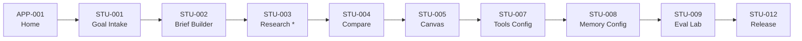
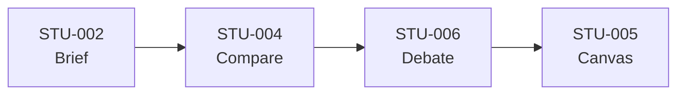
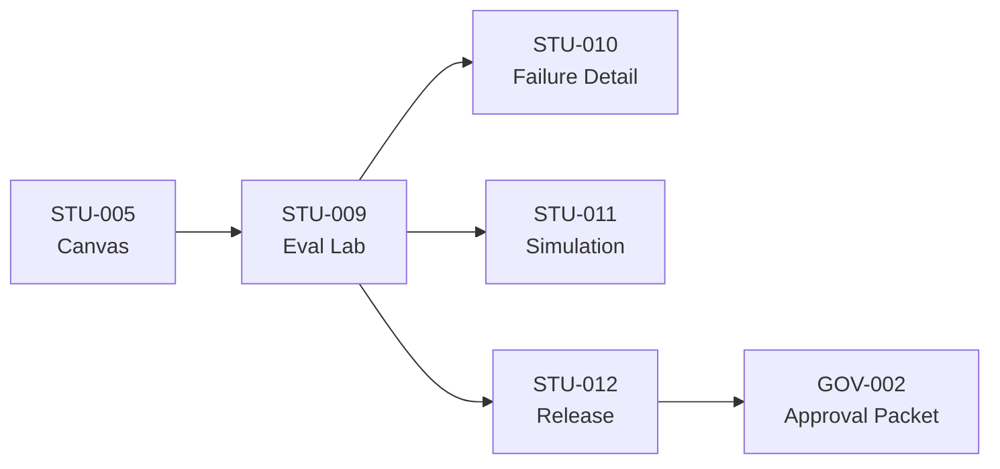
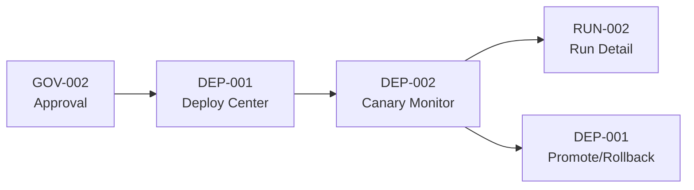
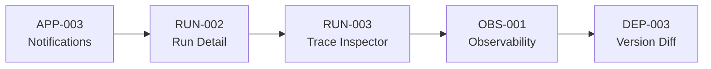
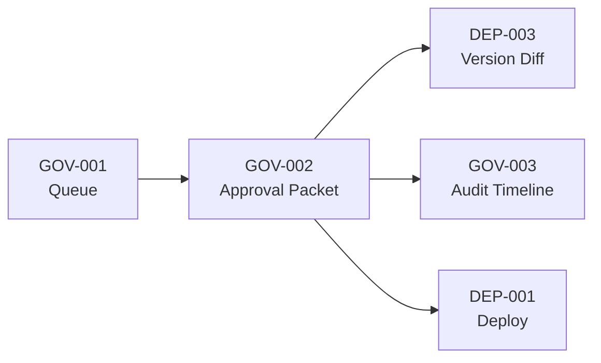

# Agent Architect Pro — UI/UX Deep Dive

> Complete specification of all screens, components, flows, wireframes, design tokens, interaction patterns, and accessibility requirements.

---

## 1. Design Philosophy

### What Agent Architect Pro IS and IS NOT

| ✅ It IS | ❌ It is NOT |
|---------|-------------|
| A **lifecycle-driven studio** | A generic cloud dashboard |
| Role-aware entry points for 4 personas | A one-size-fits-all admin panel |
| Comparison and review as first-class flows | A chat-first copilot workspace |
| Progressive disclosure with evidence ladders | A dense BI dashboard |
| AI-native but calm and trustworthy | A sci-fi, neon-heavy interface |

### North-Star Product Expression

> Agent Architect Pro should feel like a hybrid of an **expert design studio**, a **release control center**, and an **AI operations console**.

The user should always be able to answer **6 questions quickly**:
1. **What** is this agent for?
2. **Why** was this design chosen?
3. **What changed** between versions?
4. **Is it safe** to deploy?
5. **Is it working** in production?
6. **What should I do next?**

### Why "Lifecycle Studio" Wins

| Direction Evaluated | Verdict | Reason |
|-------------------|---------|---------|
| **A. Dashboard-first** | ❌ Reject | Over-centers operations, under-serves creation and trust-building |
| **B. Chat-first copilot** | ⚪ Partial | Useful inside the product, not AS the product |
| **C. Node-graph builder** | ⚪ Partial | Keep as secondary design view — too implementation-centric as primary |
| **D. Lifecycle studio** | ✅ Recommended | Fits end-to-end lifecycle, supports multiple roles, enables progressive disclosure |

---

## 2. Personas & Jobs-to-be-Done

| Persona | Primary Goals | What They Need From UI | Success Signal |
|---------|--------------|----------------------|----------------|
| **Agent Builder** | Turn a business problem into a capable agent | Structured intake, candidate architectures, editable tools/memory, understandable rationale | Can move from vague goal to approved design confidently |
| **ML / Platform Engineer** | Make agents robust, observable, release-safe | Runtime health, traces, version diffs, model/tool usage, evaluation evidence, deployment controls | Can debug and improve without losing provenance |
| **Governance / Risk Owner** | Approve or block changes based on evidence | Policy visibility, audit trails, risk summaries, unresolved issues, sign-off workflows | Can justify a release decision defensibly |
| **Executive / Sponsor** | Understand portfolio health, value, and risk | Plain-English summaries, outcomes, deployment status, quality trends | Can understand state and risk in minutes, not hours |

---

## 3. Information Architecture

### Global Navigation (9 sections)

```
Home · Studio · Runs · Knowledge · Deployments · Observability · Governance · Executive · Settings
```

| Area | Purpose | Default Audience | Key Objects |
|------|---------|-----------------|-------------|
| **Home** | Orient quickly — active work, risks, next actions | All users | Recent agents, active runs, alerts, pending approvals |
| **Studio** | Create/improve agents across full lifecycle | Builders, Engineers | Briefs, candidates, tools, memory, evaluation packages |
| **Runs** | Inspect live and historical activity | Engineers, Operators | Runs, tasks, failures, timelines |
| **Knowledge** | Manage sources, retrieval assets, templates | Builders, Engineers | Documents, indexes, templates, episodes |
| **Deployments** | Review versions, environments, canaries, rollback | Engineers, Governance | Versions, environments, releases |
| **Observability** | Deep diagnostic visibility | Engineers, Operators | MELT data, incidents, latency, cost |
| **Governance** | Policy, approvals, audit, risk posture | Governance, Engineers | Approvals, violations, audit records |
| **Executive** | Portfolio view of outcomes and risk | Executives | Portfolio cards, trends, status summaries |
| **Settings** | Workspace config, policy presets, integrations | Admin, Governance | Profiles, access control, connectors |

### Agent-Level Navigation (7 sections)

Within each agent, a secondary nav keeps the lifecycle readable:
```
Overview · Brief · Design · Evaluation · Versions · Runtime · Audit
```

### Role-Aware Behavior

Same platform, different entry points:
- **Builder** → Home shows unfinished Studio work first
- **Operator** → Home shows incidents and live runs first
- **Executive** → Home shows portfolio outcomes first

---

## 4. The Three-Panel Studio Layout

The flagship interaction pattern used across Studio, Evaluation, and Configuration screens:

```
┌─────────────┬──────────────────────────────┬───────────────────┐
│             │                              │                   │
│   LEFT      │       CENTER                 │     RIGHT         │
│   Steps /   │       Main Artifact          │     AI Guidance   │
│   Progress  │       Canvas                 │     Insights      │
│   Nav       │                              │     Warnings      │
│             │                              │     Next Actions   │
│  Brief      │   Architecture / Brief /     │     Validation    │
│  Research   │   Comparison / Config /      │     Status        │
│  Design     │   Evaluation View            │     Open          │
│  Debate     │                              │     Questions     │
│  Memory     │                              │                   │
│  Tools      │                              │     Context:      │
│  Eval       │                              │     Selected      │
│  Release    │                              │     Tools         │
│             │                              │     Memory Policy │
│             │                              │     Risk Level    │
└─────────────┴──────────────────────────────┴───────────────────┘
```

**Why three panels?**
- **Left** = progress and orientation (where am I in the lifecycle?)
- **Center** = the main artifact (the thing I'm working on)
- **Right** = advice, risk, and next-step guidance (what should I do?)

> [!IMPORTANT]
> **Do not reduce the Studio to a chat window.** Users must inspect architecture, memory, tools, and evaluation as first-class objects. The right rail should always expose AI suggestions, validation state, unresolved questions, and release readiness.

---

## 5. Screen Inventory (30 Screens)

### Global Screens (3)

| Screen ID | Name | Level | Route | Priority | Key Modules |
|-----------|------|-------|-------|----------|-------------|
| **APP-001** | Home Dashboard | Global | `/home` | P0 | Recent agents, active runs, approvals queue, release health, alerts, quick actions |
| **APP-002** | Global Command Palette | Overlay | `⌘K / Ctrl+K` | P0 | Search field, grouped results, quick actions, recent destinations |
| **APP-003** | Notifications Center | Overlay | Bell icon | P1 | Alert feed, filters, status markers |

**APP-001 States:** Default, loading, empty, alert-heavy, permission-limited
**APP-002 States:** Closed, open, no results, keyboard-only

### Studio Screens (8)

| Screen ID | Name | Route | Priority | Purpose |
|-----------|------|-------|----------|---------|
| **STU-001** | Create Agent – Goal Intake | `/studio/new` | P0 | Convert plain-language request into structured intake |
| **STU-002** | Brief Builder | `/studio/brief` | P0 | Editable structured brief — gateway to architecture generation |
| **STU-003** | Research Summary | `/studio/research` | P1 | Evidence bridge between brief and design |
| **STU-004** | Architecture Comparison Board | `/studio/architectures` | P0 | Side-by-side comparison of candidates with tradeoffs |
| **STU-005** | Architecture Canvas | `/studio/architectures/:id` | P0 | Node-and-panel view of one architecture |
| **STU-006** | Debate Review | `/studio/debate` | P1 | Structured reasoning — proposal, critique, revision, recommendation |
| **STU-007** | Tools & Permissions Config | `/studio/tools` | P0 | Tool access, permissions, approval rules |
| **STU-008** | Memory & Retrieval Config | `/studio/memory` | P0 | Retrieval mode, source groups, episodic memory |

### Evaluation Screens (4)

| Screen ID | Name | Route | Priority | Purpose |
|-----------|------|-------|----------|---------|
| **STU-009** | Evaluation Lab Overview | `/studio/evaluation` | P0 | Verdict banner + grouped failures + evidence |
| **STU-010** | Evaluation Failure Detail | `/studio/evaluation/failures/:id` | P1 | Drilldown for debugging, not blame |
| **STU-011** | Scenario Simulation Review | `/studio/simulations/:id` | P1 | Synthetic vs live distinction visible |
| **STU-012** | Release Readiness | `/studio/release` | P0 | Airlock between design and production |

### Runs Screens (3)

| Screen ID | Name | Route | Priority | Purpose |
|-----------|------|-------|----------|---------|
| **RUN-001** | Runs Explorer | `/runs` | P1 | Table + filters for all active/historical runs |
| **RUN-002** | Run Detail Timeline | `/runs/:id` | P0 | Timeline of events, tasks, decisions |
| **RUN-003** | Trace & Tool Inspector | `/runs/:id/trace` | P0 | Most technical screen — waterfall + payloads |

### Deployment Screens (3)

| Screen ID | Name | Route | Priority | Purpose |
|-----------|------|-------|----------|---------|
| **DEP-001** | Deployment Center | `/deployments` | P0 | Environments, versions, rollout controls, health |
| **DEP-002** | Canary Rollout Monitor | `/deployments/canary/:id` | P1 | Delta charts, canary vs baseline |
| **DEP-003** | Version Diff | `/deployments/versions/:a...:b` | P0 | What exactly changed between versions |

### Knowledge Screens (2)

| Screen ID | Name | Route | Priority |
|-----------|------|-------|----------|
| **KNO-001** | Knowledge Explorer | `/knowledge` | P1 |
| **KNO-002** | Source Detail & Index Status | `/knowledge/sources/:id` | P2 |

### Governance Screens (3)

| Screen ID | Name | Route | Priority | Purpose |
|-----------|------|-------|----------|---------|
| **GOV-001** | Governance Queue | `/governance` | P1 | Queue of approvals, violations, blocked releases |
| **GOV-002** | Approval Packet | `/governance/approvals/:id` | P0 | **Where trust becomes a decision** — executive summary, evidence, sign-off |
| **GOV-003** | Audit Timeline | `/governance/audit/:id` | P1 | Chronological audit view with hash evidence |

### Executive & Settings (2)

| Screen ID | Name | Route | Priority |
|-----------|------|-------|----------|
| **EXE-001** | Executive Portfolio | `/executive` | P2 |
| **SET-001** | Settings & Policy Profiles | `/settings` | P2 |

---

## 6. User Flows (6 Primary Flows)

### FL-01: Create a New Agent (P0 — Hero Flow)



| Step | From → To | User Intent | Success Outcome |
|------|-----------|------------|-----------------|
| 1 | Home → Goal Intake | Create a new agent | Goal intake launched |
| 2 | Intake → Brief Builder | Structure the goal | Brief drafted and editable |
| 3 | Brief → Research* | Review evidence | Evidence accepted or gaps flagged |
| 4 | Research → Compare | Generate candidates | Decision-ready candidate set |
| 5 | Compare → Canvas | Inspect chosen architecture | Candidate understood and refined |
| 6 | Canvas → Tools | Configure permissions | Tool policy accepted |
| 7 | Tools → Memory | Configure knowledge | Retrieval/memory design accepted |
| 8 | Memory → Eval Lab | Run evaluation | Quality verdict produced |
| 9 | Eval → Release | Package release | Release-ready packet created |

*Step 3 is optional but recommended

### FL-02: Compare & Choose Architecture (P1)



### FL-03: Evaluate & Approve Candidate (P0)



### FL-04: Deploy & Monitor Canary (P0)



### FL-05: Investigate Runtime Failure (P1)



### FL-06: Governance Approval (P1)



---

## 7. Component Library (20 Reusable Components)

### Priority Components (P0)

| ID | Component | Category | Variants / States | Used In |
|----|-----------|----------|-------------------|---------|
| CMP-001 | **App Shell** | Layout | Default, collapsed nav, expanded nav, dense mode | All screens |
| CMP-002 | **Global Command Bar** | Input | Idle, focused, results, no results, keyboard help | APP-002 |
| CMP-003 | **Status Chip** | Feedback | Neutral, info, success, warning, critical, blocked | Most screens |
| CMP-004 | **KPI Card** | Data display | Default, with trend, with alert, compact | APP-001, EXE-001 |
| CMP-006 | **Stepper / Journey Rail** | Navigation | Default, active, complete, blocked | STU-001 to STU-012 |
| CMP-007 | **Evidence Card** | Content | Default, selected, warning, missing source | STU-003, STU-006, GOV-002 |
| CMP-008 | **Comparison Card** | Decision | Default, recommended, selected, caution | STU-004 |
| CMP-009 | **Graph Node** | Visualization | Default, selected, warning, disabled | STU-005 |
| CMP-010 | **Side Panel / Drawer** | Overlay | Closed, open, pinned | STU-005, RUN-003, GOV-003 |
| CMP-011 | **Data Table** | Data display | Default, sortable, filtered, empty, loading | RUN-001, GOV-001, DEP-001 |
| CMP-012 | **Filter Bar** | Navigation | Default, active filters, saved view | RUN-001, OBS-001, KNO-001 |
| CMP-013 | **Timeline Row** | Data display | Default, expanded, alert, selected | RUN-002, GOV-003 |
| CMP-015 | **Verdict Banner** | Feedback | Pass, caution, fail, in progress | STU-009, STU-012 |
| CMP-016 | **Checklist Panel** | Workflow | Ready, blocked, partial, approved | STU-012, GOV-002 |
| CMP-017 | **Diff Block** | Comparison | Inline diff, grouped diff, side-by-side | DEP-003 |
| CMP-020 | **Approval Action Bar** | Workflow | Pending, ready, blocked, signed | GOV-002 |

### Secondary Components (P1)

| ID | Component | Category | Used In |
|----|-----------|----------|---------|
| CMP-005 | Quick Action Card | Action | APP-001 |
| CMP-014 | Trace Waterfall | Visualization | RUN-003 |
| CMP-018 | Risk Banner | Feedback | Studio, Governance, Deployments |
| CMP-019 | Source Card | Content | KNO-001, KNO-002 |

---

## 8. Extended Component Library (40+ items across 8 categories)

### Category 1: App Shell & Navigation
App shell with slots (left nav, top bar, content), side navigation (collapsed/expanded/pinned), top bar (search/alerts/profile), page header (with tabs/breadcrumbs/approval banner), command bar, right context panel

### Category 2: Core Actions & Feedback
Buttons (6 types × 3 sizes × 6 states), status chips, banners/inline alerts, tooltips, progress/loader (indeterminate, determinate, step, skeleton)

### Category 3: Forms & Inputs
Text input, textarea/prompt editor (with monospace mode), select/combobox (single/multi/searchable), segmented controls/tabs, checkbox/radio/toggle, date/range/number controls

### Category 4: Content & Data Display
Card (with slot architecture), metric tile (with sparkline), data table (comfortable + compact), list row, accordion, timeline (dense/narrative/grouped), empty state

### Category 5: AI-Native Design Modules ⭐
Architecture card, comparison matrix, debate panel, confidence meter, evidence drawer, recommendation panel

### Category 6: Evaluation, Release & Governance
Evaluation verdict, scenario heatmap, release diff viewer, approval checklist, policy matrix, audit event row

### Category 7: Deployment & Runtime
Environment switcher, rollout progress, runtime health card, incident summary, trace waterfall

### Category 8: Overlays & Utility
Modal/side sheet, dropdown/context menu, popover, pagination, breadcrumbs

---

## 9. Design Token System

### Colors (12 tokens)

| Token | Value | Usage |
|-------|-------|-------|
| `bg/default` | `#F7F9FC` | Primary app background — neutral, calm |
| `bg/surface` | `#FFFFFF` | Cards, panels, modals |
| `bg/subtle` | `#EDF4FA` | Selected rows, quiet highlights |
| `text/primary` | `#1F2937` | Main body text — high contrast |
| `text/secondary` | `#4B5563` | Secondary labels, metadata |
| `brand/primary` | `#3B5CCC` | Primary actions, AI system accents |
| `brand/deep` | `#1F4E79` | Headers, high-trust accents |
| `state/success` | `#2E7D32` | Healthy, pass, approved |
| `state/warning` | `#B7791F` | Caution, review required |
| `state/error` | `#C0392B` | Failed, blocked, degraded |
| `state/info` | `#2F75B5` | Information, neutral progress |
| `state/risk-fill` | `#FCE4D6` | Critical background fill (banners only) |

### Typography (6 scales)

| Token | Size/Height | Weight | Usage |
|-------|------------|--------|-------|
| `type/display/1` | 32/40 | Semibold | Page-level hero — use rarely |
| `type/heading/1` | 24/32 | Semibold | Primary page headings |
| `type/heading/2` | 20/28 | Semibold | Section headings (most common) |
| `type/body/1` | 14/20 | Regular | Standard body text |
| `type/body/2` | 13/18 | Regular | Dense content — tables, metadata |
| `type/label` | 12/16 | Medium | Labels, chips, control captions |

### Spacing (6 values)

| Token | Value | Usage |
|-------|-------|-------|
| `space/1` | 4px | Micro spacing |
| `space/2` | 8px | Small gaps |
| `space/3` | 12px | Compact component spacing |
| `space/4` | 16px | Default internal spacing |
| `space/5` | 24px | Section spacing |
| `space/6` | 32px | Large layout spacing |

### Radius, Elevation, Grid, Motion

| Token | Value | Usage |
|-------|-------|-------|
| `radius/sm` | 6px | Inputs, chips |
| `radius/md` | 10px | Cards, drawers |
| `radius/lg` | 14px | Large panels, hero cards |
| `shadow/sm` | 0 1 2 / 8% | Cards at rest |
| `shadow/md` | 0 6 16 / 10% | Open drawers, modals |
| `desktop/max-width` | 1440px | Primary desktop frame |
| `desktop/columns` | 12 | Core layout grid |
| `desktop/gutter` | 24px | Grid gutter |
| `icon/style` | Outlined + selective fill | Enterprise tone |
| `motion/fast` | 120ms ease-out | Hover, quick feedback |
| `motion/standard` | 180ms ease-out | Panels, tabs, overlays |

---

## 10. Screen Layout Patterns (5 Recipes)

| Pattern | Used In | Layout Description |
|---------|---------|-------------------|
| **Three-panel Studio** | Brief Builder, Studio, Memory/Tools config | Left rail (steps) + center (artifact) + right rail (suggestions/validation) |
| **Compare Workspace** | Architecture Compare, Version Compare, Canary | Top summary strip + center comparison columns + bottom diff/evidence |
| **Review Stack** | Evaluation Lab, Governance Approval, Incidents | Verdict header + grouped sections + expandable evidence + next-step actions |
| **Ops Dashboard Canvas** | Runtime Overview, Deployments, Observability | Metric strip + dense data views + persistent filters + drill-down drawer |
| **Portfolio Dashboard** | Home, Executive | Cards and trends first, deep data second, plain-English labels always visible |

---

## 11. Interaction Patterns

| Pattern | Description | Where Used |
|---------|-------------|-----------|
| **Global Command Bar** | `⌘K` / `Ctrl+K` for navigation and power actions | Everywhere |
| **Split-view Compare** | Side-by-side for candidates, versions, baseline-vs-canary | STU-004, DEP-002, DEP-003 |
| **Timeline + Graph** | Temporal and structural understanding paired | RUN-002, STU-005 |
| **Right Context Panel** | Persistent recommendations, warnings, next actions | Studio, Eval, Governance |
| **Status Chips** | Draft, In Review, Simulated, Eval Failed, Ready, Canary, Live, Degraded, Rolled Back | All screens |
| **Explainability Ladder** | Summary → Rationale → Evidence → Raw Trace | All AI-generated content |

---

## 12. Content Design, Accessibility & Trust

### Content Rules
- Say **what happened**, **why it matters**, and **what to do next**
- Prefer **plain-English summaries** before technical detail
- When uncertainty is material, **say so clearly** instead of implying certainty

### Accessibility Requirements
- WCAG-compliant contrast and focus states
- **Keyboard-first** navigation across all major workflows
- **No status communicated by color alone** — always icon + text
- Accessible tables, charts, and graph views
- Reduced motion support and screen-reader-friendly labels

### Trust Mechanics (Always Visible)
1. **Why** the system selected a candidate or took an action
2. **How much confidence** or uncertainty is attached to an output
3. **What data, tools, or policies** influenced a result
4. **What changed** between versions
5. **What fallback** or human-handoff path exists if the system is wrong

---

## 13. Figma Build Sequence (44 frames, 6 phases)

| Phase | What to Build | Frame Count | Priority |
|-------|--------------|-------------|----------|
| **00_Foundations** | Tokens, app shell, command bar, status chips, data display, visualization, overlays | 8 library items | P0 |
| **01_Global & Entry** | Home Dashboard (default + alert-heavy), Command Palette, Notifications, Goal Intake, Brief Builder | 8 frames | P0/P1 |
| **02_Studio Core** | Compare Board (default + recommended), Canvas (default + selected node), Tools Config, Memory Config, Eval Lab, Release Readiness | 10 frames | P0 |
| **03_Studio Extended** | Research Summary, Debate Review, Failure Detail, Simulation Review | 4 frames | P1 |
| **04_Runtime & Deploy** | Runs Explorer, Run Detail, Trace Inspector, Deploy Center, Canary Monitor, Version Diff, Observability | 8 frames | P0/P1 |
| **05_Governance & Knowledge** | Knowledge Explorer/Detail, Governance Queue, Approval Packet, Audit Timeline | 6 frames | P0/P1 |
| **06_Executive & Admin** | Executive Portfolio, Settings | 2 frames | P2 |

### QA Checklist (12 items)

| Check | Gate |
|-------|------|
| Page/section names follow approved structure | Before build |
| Frames use screen ID + variant + breakpoint naming | Before review |
| Tokens applied (no ad hoc colors/spacing) | Before review |
| Autolayout behaves correctly when content changes | Before review |
| Library components used (no detached one-offs) | Before review |
| Empty/loading/error states exist for P0 screens | Before prototype |
| Color contrast, semantic cues, keyboard patterns | Before review |
| Product-approved voice and terminology | Before review |
| Primary hotspots and back paths wired | Before stakeholder review |
| Complex behaviors and data assumptions annotated | Before stakeholder review |
| Design critique pass completed | Before stakeholder review |
| Developer-facing specs with states, responsive behavior, edge cases | Before engineering handoff |
