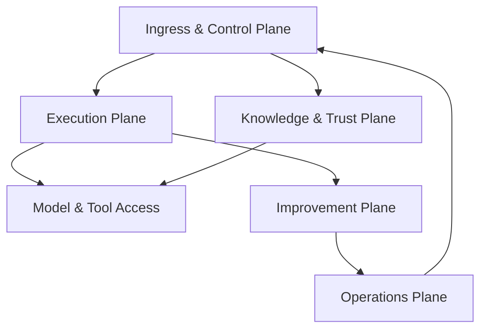

# Agent Architect Pro — Complete Documentation Analysis

> **All 19 documents fully read and analyzed.** This walkthrough distills the entire project knowledge base into a structured reference.

---

## 1. Project Vision & Scope

**Agent Architect Pro** is a production-grade, multi-agent AI platform for **designing, evaluating, deploying, and operating AI agents** through a lifecycle-driven studio experience.

### Core Lifecycle
```
Brief → Design → Compare → Evaluate → Approve → Deploy → Monitor → Improve
```

### Key Personas
| Persona | Focus |
|---------|-------|
| **Agent Builder** | Guided creation, architecture confidence, clear next steps |
| **ML / Platform Engineer** | Evaluation evidence, runtime visibility, version control |
| **Governance Owner** | Approvals, policy, auditability, release-safe visibility |
| **Executive Sponsor** | Portfolio outcomes, risk posture, adoption signals |

---

## 2. Architecture Overview

### Six-Plane Architecture



| Plane | Core Services | Key Responsibility |
|-------|--------------|-------------------|
| **Control** | API Gateway, Supervisor, Planner | Run lifecycle, plan generation, state management |
| **Execution** | Swarm Orchestrator, Runtime Manager, Sandbox Executor | Task scheduling, worker management, sandboxed execution |
| **Knowledge** | Retrieval Service, Artifact Catalog, Episodic Memory | Vector search (pgvector), source indexing, context management |
| **Trust** | Policy Engine, Audit Ledger, Approval Workflows | OIDC/RBAC, policy enforcement, append-only audit trail |
| **Improvement** | Evaluation Harnesses, Replay/Simulation, Episode Summarizer | Benchmarking, replay framework, quality evidence |
| **Operations** | Observability Stack, Release Manager, Canary Controller | Metrics/logs/traces, artifact signing, rollout automation |

### Non-Negotiable Rules
- Keep the online path **boring and reliable**
- Move experimental features to the **offline improvement plane**
- All external actions go through the **Tool Broker** (choke point)
- All model calls go through the **Model Gateway** (choke point)
- **Observability and auditability from day one**
- No production release without **signed artifact + evaluation report + approval evidence**

---

## 3. Technology Stack

| Layer | Technology |
|-------|-----------|
| Backend | **Python** (FastAPI, Temporal SDK) |
| Frontend | **TypeScript** (Next.js) |
| Database | **PostgreSQL** (with pgvector for embeddings) |
| Messaging | **Kafka** (async events) |
| Orchestration | **Temporal** (workflow orchestration) |
| Container | **Kubernetes** |
| Observability | **OpenTelemetry** (traces, logs, metrics) |
| Auth | **OIDC** + short-lived **JWTs** + **RBAC** |
| Secrets | **Vault** or cloud-native KMS |

---

## 4. API Contract Summary

### Synchronous APIs
| Service | Key Endpoints | Notes |
|---------|--------------|-------|
| **Supervisor** | `POST /v1/runs`, `GET /v1/runs/{id}`, `DELETE /v1/runs/{id}` | Idempotency keys, tenant context |
| **Planner** | `POST /v1/plans` | Plan generation from brief |
| **Retrieval** | `POST /v1/search` | Filters, scope, permission-aware |
| **Tool Broker** | `POST /v1/tools/{id}/execute` | Policy-mediated, audit-logged |
| **Model Gateway** | `POST /v1/models/complete` | Provider abstraction, routing policy |

### Standard Patterns
- JSON over HTTPS with URI versioning (`/v1/`)
- Bearer token auth (short-lived JWTs)
- Standard request/response envelopes with `correlation_id`
- Idempotency keys for mutating operations
- Structured error codes and `error_envelope` format

### Key Async Events
`run.created`, `plan.ready`, `task.submitted`, `task.completed`, `evaluation.complete`, `release.approved`, `canary.started`, `canary.promoted`, `canary.rolled_back`

---

## 5. Core Data Schemas

| Schema | Purpose |
|--------|---------|
| `RunSpec` | Run configuration (goal, constraints, tenant) |
| `PlanSpec` | Generated plan with tasks and dependencies |
| `TaskSpec` | Individual executable task |
| `TaskResult` | Task execution outcome with traces |
| `EvaluationReport` | Benchmark/scenario results with verdict |
| `AuditEvent` | Immutable audit trail record |

---

## 6. UI/UX Architecture

### Design Philosophy
- **Lifecycle-driven studio** (not dashboard, not chat-first)
- **Three-panel layout**: Left (steps/nav) → Center (main artifact) → Right (AI guidance/context)
- **Progressive disclosure**: summary → grouped detail → raw evidence
- **Role-aware modes**: same system, different entry points per persona

### Screen Inventory (30 unique screens, 44 frames)

| Area | Screens | Priority Screens |
|------|---------|-----------------|
| **Global** | Home Dashboard, Command Palette, Notifications | APP-001 (P0), APP-002 (P0) |
| **Studio** | Goal Intake, Brief Builder, Research, Architecture Compare, Canvas, Debate, Tools Config, Memory Config | STU-001 to STU-008 (all P0 except STU-003/006) |
| **Evaluation** | Eval Lab, Failure Detail, Simulation Review, Release Readiness | STU-009/012 (P0) |
| **Runs** | Runs Explorer, Run Detail, Trace Inspector | RUN-002/003 (P0) |
| **Deployments** | Deployment Center, Canary Monitor, Version Diff | DEP-001/003 (P0) |
| **Governance** | Governance Queue, Approval Packet, Audit Timeline | GOV-002 (P0) |
| **Executive** | Executive Portfolio, Settings | EXE-001, SET-001 (P2) |

### 6 Primary User Flows

| Flow | Path | Priority |
|------|------|----------|
| **FL-01** Create Agent | Home → Intake → Brief → Compare → Canvas → Tools → Memory → Eval → Release | P0 |
| **FL-02** Compare Architecture | Brief → Compare → Debate → Canvas | P1 |
| **FL-03** Evaluate & Approve | Canvas → Eval Lab → Failures → Release → Approval Packet | P0 |
| **FL-04** Deploy & Monitor | Approval → Deploy Center → Canary → Run Detail → Promote/Rollback | P0 |
| **FL-05** Investigate Failure | Notifications → Run Detail → Trace Inspector → Observability → Version Diff | P1 |
| **FL-06** Governance Approval | Queue → Approval Packet → Version Diff → Audit → Deploy | P1 |

---

## 7. Design System & Tokens

### Visual Direction
- **Tone**: Calm, precise, trustworthy, AI-native (not sci-fi)
- **Palette**: Slate/white neutrals + indigo/blue accent + semantic green/amber/red
- **Density**: Comfortable for Studio, compact for Ops

### Key Design Tokens
| Token | Value | Usage |
|-------|-------|-------|
| `bg/default` | `#F7F9FC` | Primary background |
| `brand/primary` | `#3B5CCC` | Primary actions, AI accents |
| `brand/deep` | `#1F4E79` | Headers, trust accents |
| `state/success` | `#2E7D32` | Healthy, pass, approved |
| `state/warning` | `#B7791F` | Caution, review required |
| `state/error` | `#C0392B` | Failed, blocked, degraded |

### 20 Reusable Components (CMP-001 to CMP-020)
Key components: App Shell, Command Bar, Status Chip, KPI Card, Stepper, Evidence Card, Comparison Card, Graph Node, Side Panel, Data Table, Filter Bar, Timeline Row, Trace Waterfall, Verdict Banner, Checklist Panel, Diff Block, Risk Banner, Source Card, Approval Action Bar

---

## 8. Implementation Roadmap

### 12 Epics

| Epic | Window | Priority | Owner |
|------|--------|----------|-------|
| **EP-01** Platform Foundations & DevEx | Sprint 0-1 | Critical | Platform |
| **EP-02** Identity, Auth & Policy | Sprint 1-3 | Critical | Security |
| **EP-03** Control Plane Core | Sprint 1-4 | Critical | Backend |
| **EP-04** Knowledge Plane | Sprint 2-5 | High | ML Platform |
| **EP-05** Execution Plane | Sprint 3-6 | Critical | Platform |
| **EP-06** Model & Tool Access | Sprint 3-6 | Critical | Platform |
| **EP-07** Evaluation & Simulation | Sprint 5-8 | High | ML Eng |
| **EP-08** Release, Deployment & Environments | Sprint 6-9 | High | DevOps |
| **EP-09** Observability & Audit | Sprint 2-8 | Critical | SRE |
| **EP-10** Studio & Workflow UI | Sprint 4-10 | High | Frontend |
| **EP-11** Governance & Executive UX | Sprint 8-10 | Medium | Frontend |
| **EP-12** Hardening, Performance & Launch | Sprint 10-12 | Critical | Cross-functional |

### Key Milestones
| Sprint | Gate |
|--------|------|
| Sprint 2 | Foundations complete, auth skeleton, run API working |
| Sprint 5 | **Vertical-slice proof** — end-to-end flow demonstrated |
| Sprint 8 | Product UI core, evaluation & governance surfaces |
| Sprint 10 | Production readiness controls complete |
| Sprint 12 | **Pilot launch** — GA checklist met |

### Jira Backlog
- **96+ tickets** across 12 epics
- Each epic has 6 stories + 2 tasks (test automation + documentation)
- 3 spikes: Model route policy benchmark, Threat model workshop, Load test design
- 6 cross-epic dependencies tracked

---

## 9. Team Structure

### 5 Teams with Bounded Ownership

| Team | Owns | First 30 Days |
|------|------|--------------|
| **Backend/Platform** | Supervisor, Planner, Swarm, Runtime, Tool Broker, Model Gateway | Freeze contracts → Scaffold services → Wire tracing → Vertical slice |
| **Frontend/Product** | App shell, Design system, Home, Studio, Eval, Release, Runtime, Gov, Exec views | App shell + nav → Home/Studio skeletons → Brief Builder + Compare → Integrate backend |
| **ML/AI** | Retrieval quality, Model routing, Evaluation harnesses, Replay/simulation, Evidence | Define benchmarks → Retrieval indexing → Eval harness → Attach to release packets |
| **DevOps/SRE** | IaC, Kubernetes, CI/CD, Secrets, Observability, SLOs, Canary/rollback, DR | Bootstrap environments → Wire secrets/dashboards → Automate deployment → Prove rollback |
| **Governance/Security** | OIDC/RBAC, Workload identity, Policy store, Approvals, Audit, Threat modeling | Define roles/boundaries → Token/policy rules → Approval/audit schema → Threat model review |

### Shared Rules
- Work from **versioned contracts**, not assumptions
- Every feature must emit **usable telemetry**
- No undocumented fields or hidden workflow branches
- Security and governance are **part of feature completion**
- Release readiness = code + tests + docs + telemetry + rollback understanding

---

## 10. Key Dependencies

| From | To | Reason |
|------|----|--------|
| Control Plane (EP-03) | Identity (EP-02) | Run creation needs tenant/workload auth |
| Execution (EP-05) | Control (EP-03) | Swarm depends on TaskSpec contract |
| Model/Tool (EP-06) | Identity (EP-02) | Tool access needs policy enforcement |
| Release (EP-08) | Evaluation (EP-07) | Promotion requires evaluation evidence |
| Studio UI (EP-10) | Control (EP-03) | UI depends on stable run/plan APIs |
| Governance UI (EP-11) | Observability (EP-09) | Governance surfaces need audit payloads |

---

## 11. Documents Analyzed

| # | Document | Format | Key Content |
|---|----------|--------|-------------|
| 1 | SRS with Required Tech Stacks | .docx | Functional/non-functional requirements, tech stack |
| 2 | Solution Architecture Document | .docx | Six-plane architecture, service decomposition |
| 3 | API Interface Contract Pack | .docx | REST API schemas, async events, security rules |
| 4 | UI/UX Product Spec | .docx | Lifecycle-driven studio approach, personas, workflows |
| 5 | C4 Component Spec | .docx | Service-level component view per plane |
| 6 | One-Page Architecture Table | .docx | Condensed architecture summary |
| 7 | Implementation Roadmap | .docx | 12-sprint plan, epics, milestones |
| 8 | Master Execution Command Manual | .docx | 25 CMDs across 5 phases with review gates |
| 9 | Phase-by-Phase TODO Playbook | .docx | 11 phases of implementation checklists |
| 10 | Team-by-Team Implementation Pack | .docx | 5-team operating model with 30-day plans |
| 11 | Component-by-Component Figma Library Brief | .docx | 40+ UI components across 8 categories |
| 12 | Figma Page-by-Page Build Brief | .docx | Frame-by-frame sequencing, 44 frames, 7 phases |
| 13 | UX Wireframe Deck | .pptx | 9 slides — north-star UX, 5 wireframes |
| 14 | Engineering WBS / Jira Tickets | .xlsx | 12 epics, 96+ stories/tasks, sprints, dependencies |
| 15 | Figma Build Order Workbook | .xlsx | 44 build items, 6 prototype flows, 12 QA checks |
| 16 | Figma-Ready Screen Inventory | .xlsx | 30 screens, 20 components, 35 design tokens, 6 flows |
| 17 | Jira Import CSV | .csv | Backlog import with 96+ rows |
| 18 | Command Standard Clarification | .md | Clarifies commands are target standards |
| 19 | extract_docs.py | .py | Document extraction script (created during analysis) |

---

## 12. Critical Design Decisions

1. **Lifecycle-first UX** — Organize around agent lifecycle stages, not backend service names
2. **Temporal for orchestration** — Durable execution with built-in retry, timeout, and state management
3. **Choke-point architecture** — All model and tool access goes through gateways for policy enforcement
4. **Evidence-based releases** — No production deployment without signed artifact + evaluation report + approval
5. **Append-only audit** — Immutable audit trail for all actions, supporting compliance and governance
6. **Schema-first API design** — OpenAPI-first workflow, contracts frozen before implementation
7. **Three-panel studio layout** — Steps (left) + artifact (center) + guidance (right) for consistent workspace feel
8. **Progressive disclosure** — Summary → grouped detail → raw evidence at every level
